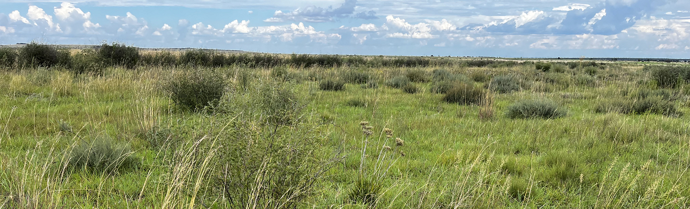
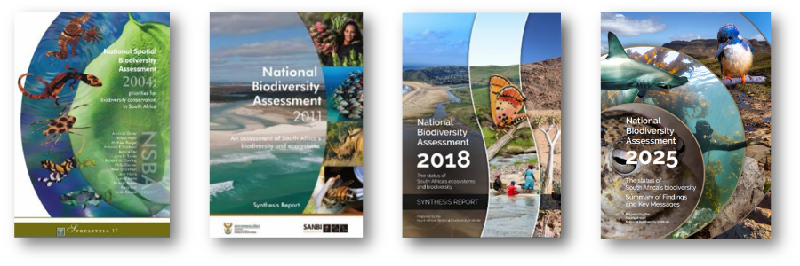

```{=html}
<!-- Outer wrapper: "column-screen" is a Quarto built-in that breaks out to full
     browser width; "nba-hero" is a custom label so custom.scss can find and style it.
     "nba-hero--status-change" is added so custom.scss can target just this page's
     credit position without affecting other pages that also use .nba-hero -->
<div class="column-screen nba-hero nba-hero--status-change">

  <!-- The banner photo itself. src = file path to the image.
       alt = text read aloud by screen readers / shown if the image fails to load -->
  

  <!-- Inner box holding just the text that sits on top of the photo -->
  <div class="nba-hero-text">

    <!-- Main page heading. <h1> tells browsers/screen readers/search engines
         "this is the most important heading on the page" -->
    <h1>Changes in terrestrial ecosystem threat status</h1>

    <!-- Subtitle sentence, as a plain paragraph -->
    <p>How the threat status of South Africa's 463 terrestrial ecosystem types has shifted
       between the 2022 gazetted list and the NBA 2025 assessment</p>

  </div> <!-- closes .nba-hero-text -->

  <!-- Photo credit, positioned independently (bottom-right) — not nested inside
       the text box above, so it can be placed separately by CSS -->
  <div class="credit">Vaalvet Sandy Grassland (© Philip Desmet)</div>

</div> <!-- closes .nba-hero, the outer wrapper -->
```

<br>

```{python libraries}
#| include: false

# =============================================================================
# LOAD LIBRARIES
# =============================================================================
# This chunk:
# 1. installs any Python packages required for the Quarto document
# 2. imports libraries for data wrangling, spatial processing, plotting, and tables
# 3. applies global display settings for cleaner output

# ── 1. INSTALL REQUIRED PACKAGES ──────────────────────────────────────────────
# Note:
# - This runs pip from inside Python.
# - If these packages are already installed in your environment, you can remove
#   this section to speed up rendering.
import subprocess

packages = ["openpyxl", "tabulate", "seaborn", "great-tables"]

for pkg in packages:
    subprocess.run(
        ["pip", "install", pkg],
        capture_output=True,
        check=True
    )

# ── 2. STANDARD LIBRARY IMPORTS ───────────────────────────────────────────────
import os          # file and folder operations (e.g. create directories, join paths)
import io          # handle in-memory byte streams (e.g. downloaded files)
import warnings    # suppress non-critical warnings during rendering

# ── 3. DATA WRANGLING ─────────────────────────────────────────────────────────
import numpy as np     # numerical operations and vectorised logic (e.g. np.select)
import pandas as pd    # tabular data manipulation: filter, join, group, reshape
import requests        # download files or access web resources via HTTP

# ── 4. SPATIAL DATA ───────────────────────────────────────────────────────────
import geopandas as gpd  # spatial vector data: read/write, project, calculate areas
import shapefile         # low-level shapefile access (pyshp)

# ── 5. VISUALISATION ──────────────────────────────────────────────────────────
import matplotlib.pyplot as plt                        # base plotting library
import matplotlib.ticker as mticker                    # custom axis tick formatting
import matplotlib.cm as cm                             # colour maps for continuous scales
import matplotlib.patches as mpatches                  # legend patches and map symbols

from matplotlib.gridspec import GridSpec               # multi-panel figure layouts
from matplotlib.colors import LinearSegmentedColormap  # custom colour gradients
from matplotlib.patches import Patch                   # legend patches for custom legends
from mpl_toolkits.axes_grid1 import make_axes_locatable  # place legends/colourbars neatly

import seaborn as sns                                  # statistical plots and styling
from IPython.display import Image                      # display saved images inline in Quarto

# ── 6. TABLES ─────────────────────────────────────────────────────────────────
from tabulate import tabulate  # format plain-text / markdown / LaTeX tables

# Package name on pip is 'great-tables', but it is imported as 'great_tables'
from great_tables import GT, loc, style, md  # build and style GT tables
import great_tables

print(great_tables.__version__)  # confirm installed version (useful for feature checks)

# ── 7. GLOBAL DISPLAY / WARNING SETTINGS ─────────────────────────────────────
warnings.filterwarnings("ignore")  # suppress noisy deprecation/runtime warnings

# Display floats in standard notation rather than scientific notation
pd.set_option("display.float_format", lambda x: f"{x:.10g}")

print("✓ All libraries loaded")
```

```{python important-codes}
#| echo: false
#| eval: false
#| include: false

# Confirm all loaded
print("RLE_2022:", RLE_2022.shape)
print(RLE_2022.columns.tolist())

print("RLE_2025:", RLE_2025.shape)
print(RLE_2025.columns.tolist())

print("EDD:", EDD.shape)  # size of your dataset
print("NVM2024Final_area:", NVM2024Final_area.shape)
print(NVM2024Final_area.columns.tolist())

# view data
print(EDD["VT Present NVM 2024"].dtype)
print(EDD["VT Present NVM 2024"].value_counts(dropna=False))
print(EDD["VT Present NVM 2024"].head(20))
EDD.head(10)
EDD["VT Present NVM 2024"].value_counts()
print(EDD.columns)
print(EDD.shape)
EDD["VT Present NVM 2024"].value_counts()
EDD["Realm_GETL1"].unique()
print(RLE_join["RLE"].unique())

print("RLE_2025 MM:")
for i, col in enumerate(RLE_join.columns):
    print(f" {i}, {col}")

```


```{python read-gdb}
#| output: false
#| echo: false
#| include: false

# Path to geodatabase
gdb = "C:/Maphale Monyeki Projects/NBA 2025/1. Input data/data/data/vegetation/NVM2024final.gdb"

# Read the layer (equivalent to sf::st_read)
NVM2024Final_IEM5 = gpd.read_file(gdb, layer="NVM2024Final_IEM5_12_07012025")

# Cast to MULTIPOLYGON, dissolve by T_MAPCODE (equivalent to st_cast + group_by + summarise)
NVM2024_area = (
    NVM2024Final_IEM5
    .explode(index_parts=False)   # Converts any MultiPolygons into individual single Polygons - st_cast("MULTIPOLYGON")
    .dissolve(by="T_MAPCODE")     # group_by(T_MAPCODE) + st_union
    .reset_index()                # It moves T_MAPCODE from being a row label to being a regular column
)

# Remove non-terrestrial features and Western Lesotho Basalt Shrubland
NVM2024_area = NVM2024_area[
    ~NVM2024_area["T_Name"].str.lower().str.startswith("non-terrestrial", na=False) &
    ~(NVM2024_area["T_MAPCODE"] == "Gd9") # Western Lesotho Basalt Shrubland
]

# Calculate area in km² (equivalent to st_area)
NVM2024_area = NVM2024_area.to_crs(NVM2024Final_IEM5.crs)
NVM2024_area["Historic_area_km2"] = NVM2024_area.geometry.area / 1e6
print(NVM2024Final_IEM5.crs)
print(NVM2024_area)
print(NVM2024_area[["T_MAPCODE", "T_Name", "Historic_area_km2"]].sort_values("Historic_area_km2", ascending=False).head(10))

# Create output directory (equivalent to dir.create)
os.makedirs("../data", exist_ok=True)  # creates the folder data inside Contents (and Contents itself if it doesn't exist yet

# Drop geometry and save as DBF (equivalent to write.dbf + st_drop_geometry)
df_out = NVM2024_area.drop(columns="geometry") # Drops the geometry column 
df_out.to_csv("../data/NVM2024Final_IEM5_12_07012025_areakm2.csv", index=False) # index=False prevents pandas from writing the row numbers (0, 1, 2...) as an extra column in the file

#print(NVM2024_area.shape) # .shape, .crs, .columns or .area is a built-in pandas property that every DataFrame automatically has. You don't need to define it
print(NVM2024_area.columns.tolist()) # .columns returns the column names, and .tolist() converts them to a plain Python list so they print cleanly

NVM2024_area.to_file("../spatial data/NVM2024Final_IEM5_12_07012025_dissolved.shp")

```


```{python Clip2SA}

gdb = "C:/Maphale Monyeki Projects/NBA 2025/1. Input data/data/data/boundaries/SA_boundaries_NBA2025.gdb"

# Read the provincial boundaries layer
provinces = gpd.read_file(gdb, layer="SA_provinces")

# Build the SA boundary by removing Lesotho and Eswatini as a "hole"
# (simple filter + dissolve doesn't create proper holes for enclaves like Lesotho,
# so we dissolve everything, then subtract the Lesotho/Eswatini shape)
all_provinces = provinces.dissolve()
non_sa = provinces[provinces["PROVINCE"].isin(["not SA - Eswatini", "not SA - Lesotho"])].dissolve()

#.iloc[0] selects the first row of a DataFrame or GeoDataFrame by position regardless of what the row's actual index label is.
sa_boundary = gpd.GeoDataFrame(
    geometry=all_provinces.geometry.difference(non_sa.geometry.iloc[0]),
    crs=provinces.crs
)

# Clip the vegetation map to South Africa only
NVM2024_area_clipped = NVM2024_area.clip(sa_boundary)

# Recalculate area (no need to reproject - already in equal-area AEA CRS)
NVM2024_area_clipped["Historic_area_km2"] = NVM2024_area_clipped.geometry.area / 1e6
#print(NVM2024_area_clipped["Historic_area_km2"].sum())
```


```{python load-data}
#| output: false
#| echo: false
#| include: false

url = "https://raw.githubusercontent.com/SeithatiMonyeki/RLE-assessments-for-terrestrial-realm-NBA-2025/main/Contents/6.Results/Core/2018%20RLEcore%20assessments_June2025.xlsx"

response = requests.get(url)
RLE_2018_MM = pd.read_excel(io.BytesIO(response.content))

criteria = pd.read_excel("../data/combination crieria description.xlsx")

# Read local CSV with Latin-1 encoding
RLE_2022 = pd.read_csv("../data/RLE20200528_FULLDATASET_for sharing.csv", encoding="latin-1")

# Read CSV from GitHub URL
RLE_2025 = pd.read_csv("https://raw.githubusercontent.com/SANBI-TER-ECO/RLE_terr/main/outputs/ter_results_type_rle_epl.csv")

RLE_2025_MM = pd.read_csv("https://raw.githubusercontent.com/SeithatiMonyeki/RLE-assessments-for-terrestrial-realm-NBA-2025/main/Contents/6.Results/Core/2022%20RLEcore%20assessments_June2025.csv")

EDD = pd.read_csv("https://raw.githubusercontent.com/VEGMAP/countryr_ecosystemfile/VEGMAPProject_main/EDDFullfile_L4L5_V4_17092025s.csv")

# Read CSV instead of DBF (we saved as CSV earlier)
NVM2024Final_area = pd.read_csv("../data/NVM2024Final_IEM5_12_07012025_areakm2.csv")

```

```{python provinces_per_eco}
#| output: false
#| echo: false
#| include: false

# ::::::::::::::::::::::::::::::::::::::::::::::::::::::::::::::::::::::::::::::
# Step 1: Identify columns that start with "Distr_"
# ══════════════════════════════════════════════════════════════════════════════
distr_cols = [col for col in EDD.columns if col.startswith("Distr_")]

# ::::::::::::::::::::::::::::::::::::::::::::::::::::::::::::::::::::::::::::::
# Step 2: Identify all other columns to keep during reshape
# ══════════════════════════════════════════════════════════════════════════════
id_cols = [col for col in EDD.columns if not col.startswith("Distr_")]

# Step 3: Reshape from wide to long format
df_long = EDD.melt(              # .melt() converts the data from wide to long format 
    id_vars=id_cols,             # columns to keep as-is (the non-Distr_ ones)
    value_vars=distr_cols,       # unstack e.g. end up with 9 rows — one per province.
    var_name="province_col",     # new column that holds the old Distr column names
    value_name="Province"        # name for the new column that holds the values (1, 0 etc.)
)

# ::::::::::::::::::::::::::::::::::::::::::::::::::::::::::::::::::::::::::::::
# Step 4: Force Province column to string and strip whitespace
# ══════════════════════════════════════════════════════════════════════════════
df_long["Province"] = df_long["Province"].fillna("").astype(str).str.strip() # Prov col may have NA, mixed types, .astype(str)-converts all values to text/string type while .str.strip() removes extra spaces

# Step 5: Remove empty and nan rows
df_long = df_long[df_long["Province"] != ""]
df_long = df_long[df_long["Province"] != "nan"] # NaN gets converted to a string by .astype(str), it becomes the literal text "nan" instead of a missing value)

# ::::::::::::::::::::::::::::::::::::::::::::::::::::::::::::::::::::::::::::::
# Step 6: Collapse provinces into one comma-separated row per Code
# ══════════════════════════════════════════════════════════════════════════════
Provinces = df_long.groupby("Code")["Province"].apply(lambda x: ", ".join(x)) # groups by "Code" and collapses all provinces for each code into a single comma-separated string e.g AT15 WC, EC, NC.
Provinces = Provinces.reset_index() #  moves "Code" from being a row label back into a regular column, and replaces the row labels with plain numbers (0, 1, 2...).
Provinces.columns = ["Code", "Province"] # rename to keep things clean

# Confirm output
print(Provinces.head())
print(Provinces.columns.tolist())
print("Provinces shape:", Provinces.shape)

```

```{python rle-data}
#| output: true
#| echo: false
#| include: false

# ::::::::::::::::::::::::::::::::::::::::::::::::::::::::::::::::::::::::::::::
# STEP 1: DEFINE THREAT ORDER
# ══════════════════════════════════════════════════════════════════════════════
# Equivalent to R: threat_order <- c("CR", "EN", "VU", "LC")
threat_order = ["CR", "EN", "VU", "LC"]

# ::::::::::::::::::::::::::::::::::::::::::::::::::::::::::::::::::::::::::::::
# STEP 2: FILTER ROWS
# ══════════════════════════════════════════════════════════════════════════════
#---- Strip whitespace from column names across all listed dataframes ---
for df in [EDD, NVM2024Final_area, RLE_2025, Provinces, RLE_2022]:
    df.columns = df.columns.str.strip()

#---- removes all columns whose names start with "Unnamed" from the EDD dataframe ---
# loc selects rows and/or columns by label or condition
# keep all rows (:) and only columns whose name does NOT (~ is NOT operator) start with "Unnamed"
EDD = EDD.loc[:, ~EDD.columns.str.startswith("Unnamed")]

# ::::::::::::::::::::::::::::::::::::::::::::::::::::::::::::::::::::::::::::::
# STEP 3: RENAME COLUMNS
# ══════════════════════════════════════════════════════════════════════════════
# Equivalent to R: rename(Name = EcosystemType_GETLevel5_6, Biome = ...)
EDD.columns = EDD.columns.str.strip()
EDD.rename(columns={
    "EcosystemType_GETLevel5_6"                               : "Name",
    "Biome (GET L3)_Ecosystem_Fuctional_Groups (GET Level 3)" : "Biome",
    "BioregionGETL4_Biogeographic_ecotypes"                   : "Bioregion"}, inplace=True)

EDD = EDD[[
            "Realm_GETL1", "Code", "Name",
            "Bioregion", "Biome",
            "IUCN_GET_2025_L2", "IUCN_GET_2022_L3",
            "CountryEcoTypeExtendInto_Political",
            "Distribution_full_descr", "Landscape",
            "Climate_full_descr", "GeologySoilsHydrology","VT Present NVM 2024",
            "RLE_2018_2022", "RLE_2025", "EPL_2025"
            ]]    

# ::::::::::::::::::::::::::::::::::::::::::::::::::::::::::::::::::::::::::::::
# STEP 4: MUTATE — RECODE Realm_GETL1 AND RECODE 
# ══════════════════════════════════════════════════════════════════════════════

# --- 4a. Recode Realm_GETL1 ---
# Equivalent to R: case_when(Realm_GETL1 == "Terrestrial/Freshwater" ~ "Terrestrial", TRUE ~ Realm_GETL1)
EDD["Realm_GETL1"] = EDD["Realm_GETL1"].replace("Terrestrial/Freshwater", "Terrestrial")

# --- 4b. Filter: Terrestrial + NVM 2024 present ---   
# .copy() creates a completely independent copy of the filtered dataframe            
EDD = EDD[(EDD["VT Present NVM 2024"] == True) & (EDD["Realm_GETL1"] == "Terrestrial")].copy()

# --- 4c. Remove rows with missing or unassessed RLE_2025 ---                     
EDD = EDD[EDD["RLE_2025"].notna() & (EDD["RLE_2025"] != "DD")].copy()
#
# --- 4d. Create RLE_2022 ---
EDD["RLE_2022"] = np.where(
(EDD["Name"] == "Lamberts Bay Strandveld") &  (EDD["RLE_2018_2022"] == "Not Evaluated"), "CR", 
    EDD["RLE_2018_2022"]                            
)

# ::::::::::::::::::::::::::::::::::::::::::::::::::::::::::::::::::::::::::::::
# STEP 5: MUTATE — CREATE RANKS AND STATUS_CHANGE
# ══════════════════════════════════════════════════════════════════════════════

# --- 5a. Define the ranking dictionary
rank_map = {
    "CR": 4,   # most threatened
    "EN": 3,
    "VU": 2,
    "LC": 1    # least threatened
}

# --- 5b. Apply the mapping to both columns
# .map(rank_map) → replaces each category with its rank number
# Values not in rank_map (e.g. "NE", "(blank)") become NaN
EDD["rank_2022"] = EDD["RLE_2022"].map(rank_map)  # ← missing
EDD["rank_2025"] = EDD["RLE_2025"].map(rank_map)  # ← missing

# --- 5c. Shows you which values in RLE_2022 and RLE_2025 failed to map (i.e. were not found in rank_map and became NaN)
print("Unmapped RLE_2022:", EDD.loc[EDD["rank_2022"].isna(), "RLE_2022"].unique())
print("Unmapped RLE_2025:", EDD.loc[EDD["rank_2025"].isna(), "RLE_2025"].unique())

# --- 5d. Classify status change ---
both_ranked = EDD["rank_2022"].notna() & EDD["rank_2025"].notna()

pairs = [
     # CONDITION                                    ,        CHOICE  
    (EDD["RLE_2022"].isin(["Not Evaluated", "(blank)"]),  "New types"),
    (both_ranked & (EDD["rank_2022"] == EDD["rank_2025"]), "Unchanged"),
    (both_ranked & (EDD["rank_2022"] >  EDD["rank_2025"]), "Downlisted"),
    (both_ranked & (EDD["rank_2022"] <  EDD["rank_2025"]), "Uplisted"),
]

# zip(*pairs) splits the pairs back into two separate lists:
# conditions = [condition1, condition2, condition3, condition4]
# choices    = [choice1,    choice2,    choice3,    choice4   ]
# np.select() needs them as separate lists, so this is a necessary step
conditions, choices = zip(*pairs)
EDD["Status_Change"] = np.select(conditions, choices, default=None)

# ::::::::::::::::::::::::::::::::::::::::::::::::::::::::::::::::::::::::::::::
# STEP 6: DROP TEMPORARY RANK COLUMNS
# ══════════════════════════════════════════════════════════════════════════════
# Helper columns ("rank_2022", "rank_2025") and inplace=True → retains everything else
EDD.drop(columns=["rank_2022", "rank_2025"], inplace=True)

# ::::::::::::::::::::::::::::::::::::::::::::::::::::::::::::::::::::::::::::::
# STEP 5: LEFT JOINS   
# ══════════════════════════════════════════════════════════════════════════════
# suffixes=("", "_x") → keeps RLE columns as-is, renames duplicates from right table

RLE_join = EDD.merge(NVM2024_area_clipped, left_on  = "Code", right_on = "T_MAPCODE", how  = "left",suffixes = ("", "_NVM"))

RLE_join = RLE_join .merge(RLE_2025, left_on = "Code", right_on = "T_MAPCODE", how = "left", suffixes = ("", "_RLE2025"))

RLE_join = RLE_join.merge(criteria, left_on="Criteria_triggered", right_on="Criteria triggered", how="left")

RLE_join = RLE_join.merge(RLE_2025_MM, left_on = "Code", right_on = "MapCode", how = "left", suffixes = ("", "_RLE2025_MM"))

RLE_join = RLE_join.merge(RLE_2018_MM, left_on  = "Code", right_on = "MapCode",how = "left", suffixes = ("", "_RLE2018"))

RLE_join = RLE_join .merge(RLE_2022, left_on  = "Code", right_on = "MAPCODE18",how = "left", suffixes = ("", "_RLE2022"))

RLE_join = RLE_join.merge(Provinces, on = "Code", how = "left")    # no suffixes needed, no duplicates

# show all rows where Status_Change is empty/missing, and print selected columns so I can inspect those records
print(RLE_join.loc[RLE_join["Status_Change"].isna(), ["Realm_GETL1", "Code", "Name", "RLE_2022", "RLE"]])

# excludes types not assessed e.g. Western Lesotho Basalt Shrubland, Swamp Forest, Mangrove Forest
RLE_join = RLE_join[RLE_join["RLE_2025"].notna()].copy()
print(RLE_join["RLE_2025"].value_counts())
print(RLE_join.shape)

# ::::::::::::::::::::::::::::::::::::::::::::::::::::::::::::::::::::::::::::::
# STEP 9: MUTATE — CREATE ETS FLAG   
# ══════════════════════════════════════════════════════════════════════════════
# Create a new column "ETS" that checks if RLE_2025 matches the RLE column
# Equivalent to R: mutate(ETS = case_when(RLE_2025 == RLE ~ "TRUE", TRUE ~ "FALSE"))
RLE_join["ETS"] = np.where(RLE_join["RLE_2025"] == RLE_join["RLE"], "TRUE", "FALSE") 
print(RLE_join["ETS"].unique())   
print(RLE_join["ETS"].value_counts())
print(RLE_join.columns.tolist())

#print("RLE_2025 MM:")
#for i, col in enumerate(RLE_join.columns):
#    print(f" {i}, {col}")

# ::::::::::::::::::::::::::::::::::::::::::::::::::::::::::::::::::::::::::::::
# STEP 10: ADD COLUMN WITH A CHANGE IN STATUS
# ══════════════════════════════════════════════════════════════════════════════
def concat_rle(row):
    rle_2022 = row["RLE_2022"]
    rle_2025 = row["RLE_2025"]
    
    if pd.isna(rle_2022) or rle_2022 == "":
        return rle_2025                        # no 2022 entry, just show 2025
    elif rle_2022 == rle_2025:
        return f"{rle_2022}↔{rle_2025}"       # same status, bidirectional arrow
    else:
        return f"{rle_2022} → {rle_2025}"       # status changed, single arrow

RLE_join["RLE2022_2025"] = RLE_join.apply(concat_rle, axis=1)
RLE_join.head(5)
# ::::::::::::::::::::::::::::::::::::::::::::::::::::::::::::::::::::::::::::::
# STEP 11: FINAL COLUMN SELECTION BY POSITION
# ══════════════════════════════════════════════════════════════════════════════
#| results: show
RLE_subset = RLE_join[
    ["Realm_GETL1", "Code", "Name", "Bioregion", "Biome",
     "IUCN_GET_2025_L2", "IUCN_GET_2022_L3", "Distribution_full_descr",
     "Province", "CountryEcoTypeExtendInto_Political",
     "Contry", "Landscape", "Climate_full_descr",
     "GeologySoilsHydrology", "Historic_area_km2", "Nat2018", "Nat.2022km2", "EPL_2025", "RLE_2022",
     "RLE_2025", "RLE2022_2025", "Criteria_triggered", "Criteria description", "Status_Change"]
].copy()

print("RLE_subset:"),
for i, col in enumerate(RLE_subset.columns):
    print(f" {i}, {col}")   

RLE_subset.to_excel("../data/RLE_subset.xlsx", index=False)

#**********************************************************************************************************# 
#                   ATLERNATIVE APPROACH FOR SUBSETTING COLUMS USING COLUMN POSITION                       #
# print("RLE_subset columns with positions:")                                                              #
# for i, col in enumerate(RLE_subset.columns): # one at a time, give me its number (i) and its name (col)  #
# print(f"{i}: {col}") # Print the position number, then a colon, then the column name — for every column  #
#                                                                                                          #
# Both iloc and loc are still 0-based in Python — the confusion here is that loc needs column names not    #
# positions, so RLE.columns[...] is used first to convert positions to names, but the positions fed into   #
# RLE.columns[] still start from 0.                                                                        #
# Select columns by their position number. MPORTANT: Python counts from 0 → subtract 1 from each R number. #
# col_positions = list(range(0, 7)) + [8, 46, 7, 47] + list(range(9, 11)) + [35, 12, 13, 14, 44, 15]       #
#                                                                                                          #
# iloc → select by position number, : → keep all rows, col_positions → list of column numbers to keep      #
# RLE_subset = RLE_join.iloc[:, col_positions]                                                             #
# *********************************************************************************************************#

# confirm final subset
print("\nRLE_subset shape:", RLE_subset.shape)
print("RLE_subset columns:")
print(RLE_subset.columns.tolist())
RLE_subset.head(10)
RLE_subset["Status_Change"].value_counts()

print("\nRLE_subset Status_Change counts:")
print(RLE_subset["Status_Change"].value_counts(dropna=False))

print(RLE_join.columns.tolist()) 
```

```{python}
#| label: hero-stats
#| echo: false
#| output: asis

from IPython.display import HTML, display

# ===========================================================
# 1. CALCULATE STATISTICS
# -----------------------------------------------------------
# Pull the numbers directly from RLE_subset so that the
# statistics automatically update when the underlying data
# changes.
# ===========================================================

n_total = RLE_subset["Code"].nunique()
n_unchanged = (RLE_subset["Status_Change"] == "Unchanged").sum()
n_uplisted = (RLE_subset["Status_Change"] == "Uplisted").sum()
n_downlist = (RLE_subset["Status_Change"] == "Downlisted").sum()
n_new = (RLE_subset["Status_Change"] == "New types").sum()

# ===========================================================
# 2. CALCULATE REMAINING NATURAL EXTENT
# ===========================================================

pct_natural = round(
    100
    * RLE_subset["Nat.2022km2"].sum()
    / RLE_subset["Historic_area_km2"].sum()
)

# ===========================================================
# 3. DEFINE SVG ICONS
# -----------------------------------------------------------
# Inline SVG icons are used so that no external icon library
# is required.
# Each icon is placed inside the circular .stat-icon element.
# ===========================================================

icons = {
    # ============================================================
    #-- 3.1 LEAF ICON — represents "ecosystem types assessed"
    # -------------------------------------------------------------
    #-- Line 1: opens a 24x24 drawing grid, hidden from screen readers (decorative)
    #-- Line 2: draws the solid leaf body using curved lines (Bezier curves)
    #-- Line 3: draws a single curved line = the leaf's center vein
    #-- Line 4-7: vein has no fill, uses theme color, medium thickness, rounded ends
    "total": """
    <svg viewBox="0 0 24 24" aria-hidden="true">
      <path
        d="M20.5 3.5C13.4 3.7 7.9 6.1 5.3 10.1
           C3.2 13.3 4.1 17.2 7.1 19.1
           C10.1 21 14.1 20.2 16.8 17.4
           C19.5 14.6 20.7 9.8 20.5 3.5Z"/>
      <path
        d="M5 20C8.1 15.5 11.4 12.2 16.5 8.5"
        fill="none"
        stroke="currentColor"
        stroke-width="1.8"
        stroke-linecap="round"/>
    </svg>
    """,
    # ========================================================
    #-- 3.2 HORIZONTAL LINE ICON — represents "unchanged"
    # --------------------------------------------------------
    #-- Line 1: opens the 24x24 grid
    #-- Line 2: draws one straight horizontal line across the middle
    #-- Line 3-6: no fill, theme color, bold thickness, rounded ends
    "unchanged": """
    <svg viewBox="0 0 24 24" aria-hidden="true">
      <path
        d="M5 12h14"
        fill="none"
        stroke="currentColor"
        stroke-width="2.2"
        stroke-linecap="round"/>
    </svg>
    """,

    # ================================================
    #-- 3.3 UP ARROW ICON — represents "uplisted"
    # ------------------------------------------------
    #-- Line 1: opens the 24x24 grid
    #-- Line 2: draws the vertical shaft, bottom to top
    #-- Line 3-6: no fill, theme color, bold thickness, rounded ends
    #-- Line 7: draws the arrowhead as a "^" chevron shape
    #-- Line 8-12: same styling, plus rounded join where the chevron lines meet
    "uplisted": """
    <svg viewBox="0 0 24 24" aria-hidden="true">
      <path
        d="M12 19V5"
        fill="none"
        stroke="currentColor"
        stroke-width="2.2"
        stroke-linecap="round"/>
      <path
        d="M6.5 10.5L12 5l5.5 5.5"
        fill="none"
        stroke="currentColor"
        stroke-width="2.2"
        stroke-linecap="round"
        stroke-linejoin="round"/>
    </svg>
    """,

    # =================================================
    #-- 3.4 DOWN ARROW ICON — represents "downlisted"
    # -------------------------------------------------
    #-- Line 1: opens the 24x24 grid
    #-- Line 2: draws the vertical shaft, top to bottom
    #-- Line 3-6: no fill, theme color, bold thickness, rounded ends
    #-- Line 7: draws the arrowhead as a "v" chevron shape
    #-- Line 8-12: same styling, plus rounded join where the chevron lines meet
    "downlisted": """
    <svg viewBox="0 0 24 24" aria-hidden="true">
      <path
        d="M12 5v14"
        fill="none"
        stroke="currentColor"
        stroke-width="2.2"
        stroke-linecap="round"/>
      <path
        d="M6.5 13.5L12 19l5.5-5.5"
        fill="none"
        stroke="currentColor"
        stroke-width="2.2"
        stroke-linecap="round"
        stroke-linejoin="round"/>
    </svg>
    """,

    # ==================================================================
    #-- 3.5 PLUS SIGN ICON — represents "new" (newly delineated types)
    # ------------------------------------------------------------------
    #-- Line 1: opens the 24x24 grid
    #-- Line 2: one path drawing both a vertical and horizontal line = "+"
    #-- Line 3-6: no fill, theme color, bold thickness, rounded ends
    "new": """
    <svg viewBox="0 0 24 24" aria-hidden="true">
      <path
        d="M12 5v14M5 12h14"
        fill="none"
        stroke="currentColor"
        stroke-width="2.2"
        stroke-linecap="round"/>
    </svg>
    """,

    # ==================================================================
    #-- 3.6 PIE CHART ICON — represents "natural" (remaining natural extent)
    # -------------------------------------------------------------------
    #-- Line 1: opens the 24x24 grid
    #-- Line 2: draws the larger pie wedge (~3/4 of the circle), filled solid
    #-- Line 3: draws the smaller wedge (~1/4 of the circle), filled solid
    "natural": """
    <svg viewBox="0 0 24 24" aria-hidden="true">
      <path
        d="M12 3a9 9 0 1 0 9 9h-9V3Z"/>
      <path
        d="M14 3.3A9 9 0 0 1 20.7 10H14V3.3Z"/>
    </svg>
    """
}

# ===========================================================
# 4. DEFINE THE STATISTICS
# -----------------------------------------------------------
# Each entry contains:
#
#   label
#   value
#   CSS class
#   icon name
#
# The CSS class controls the colour of the icon and number.
# ===========================================================

stats = [

    (
        "Ecosystem types assessed",
        f"{n_total}",
        "total",
        "total"
    ),

    (
        "Unchanged since 2022",
        f"{n_unchanged}",
        "unchanged",
        "unchanged"
    ),

    (
        "Uplisted since 2022",
        f"{n_uplisted}",
        "uplisted",
        "uplisted"
    ),

    (
        "Downlisted",
        f"{n_downlist}",
        "downlisted",
        "downlisted"
    ),

    (
        "Newly delineated ecosystem types",
        f"{n_new}",
        "new",
        "new"
    ),

    (
        "of historical extent still natural",
        f"{pct_natural}%",
        "natural",
        "natural"
    )
]


# ===========================================================
# 5. BUILD EACH STATISTIC
# -----------------------------------------------------------
# The resulting HTML structure for each statistic is:
#
# <div class="nba-fig">
#
#     <span class="stat-icon">
#         ICON
#     </span>
#
#     <div class="stat-content">
#         NUMBER
#         DESCRIPTION
#     </div>
#
# </div>
# ===========================================================

cells = "".join(

    f'''
    <div class="nba-fig is-{css_class}">

      <span class="stat-icon">
        {icons[icon_name]}
      </span>

      <div class="stat-content">

        <span class="value">
          {value}
        </span>

        <span class="label">
          {label}
        </span>

      </div>

    </div>
    '''

    for label, value, css_class, icon_name in stats
)


# ===========================================================
# 6. OUTPUT THE COMPLETE STATISTICS BAR
# ===========================================================

display(
    HTML(
        f'''
        <div class="column-screen nba-figs">

          <div class="nba-figs-inner">

            {cells}

          </div>

        </div>
        '''
    )
)

```


```{=html}
<p class="nba-authors">
  Maphale Monyeki<sup>1</sup>
  <a href="https://orcid.org/0000-0002-5083-7461"
     target="_blank"
     rel="noopener"
     aria-label="Maphale Monyeki's ORCID profile"
     class="orcid-link">
    
  </a><span class="author-sep">,</span>

  Andrew Skowno<sup>2,3</sup>
  <a href="https://orcid.org/0000-0002-2726-7886"
     target="_blank"
     rel="noopener"
     aria-label="Andrew Skowno's ORCID profile"
     class="orcid-link">
    
  </a><span class="author-sep">,</span>

  Mthobisi Nzimande<sup>1</sup><span class="author-sep">,</span>

  Anisha Dayaram<sup>1,4</sup>
  <a href="https://orcid.org/0000-0003-4160-812X"
     target="_blank"
     rel="noopener"
     aria-label="Anisha Dayaram's ORCID profile"
     class="orcid-link">
    
  </a><span class="author-sep">,</span>

  Tammy Smith<sup>1</sup>
</p> <!-- closing tag was missing in the original -->

<p class="nba-affiliation">
  <sup>1</sup> South African National Biodiversity Institute (SANBI)<span class="aff-sep">,</span>
  <sup>2</sup> Group on Earth Observations (GEO)<span class="aff-sep">,</span>
  <sup>3</sup> University of Cape Town (UCT)<span class="aff-sep">,</span>
  <sup>4</sup> University of the Witwatersrand
</p>

```

```{python}
#| label: nba-date
#| echo: false
#| output: asis

from datetime import date
from IPython.display import HTML, display

today_str = date.today().strftime("%d %B %Y")

display(HTML(f'<p class="nba-date">Published: {today_str}</p>'))
```


## Introduction

<div class="main-copy">
  <p><span class="drop-cap">I</span>n 2025, the fourth iteration of the [National Biodiversity Assessment (NBA)](https://nba.sanbi.org.za/) was released, building on more than two decades of biodiversity assessments at a national scale. The NBA is a national monitoring and reporting tool that synthesises information on the state of biodiversity in South Africa using a suite of headline indicators, including the [Red List of Ecosystems (RLE)](iucn.org/resources/conservation-tool/iucn-red-list-ecosystems), also referred to as ecosystem threat status. This indicator also forms part of the growing toolbox of ecosystem indicators recognised within the Kunming-Montreal Global Biodiversity Framework of the Convention on Biological Diversity (CBD), to which South Africa is a signatory.</p>
  </div>

The ecosystem threat status indicator is one of the longest-standing indicators reported through the NBA. In the absence of a globally recognised standard for assessing ecosystem threat status, South Africa developed and applied its own national criteria. These criteria were first systematically applied to terrestrial ecosystems, with the findings reported in the [National Spatial Biodiversity Assessment (NSBA) 2004](https://bgis.sanbi.org/Projects/Detail/55). This national approach demonstrated the feasibility of assessing the threat status of broad ecological features such as ecosystems, despite their complex and dynamic nature.

Following this initial assessment, the national criteria were refined to improve the robustness and consistency of their application and expanded to incorporate additional criteria and data. These developments enabled more detailed and comprehensive assessments of ecosystem threat status, with the findings summarised in the NBA 2011 report. To strengthen the influence of these assessments on policy and decision-making, the 2011 list of threatened ecosystems was subsequently gazetted in 2011 under the [National Environmental Management: Biodiversity Act (NEMBA)](https://www.gov.za/documents/national-environmental-management-biodiversity-act-2011). Gazetting provided a formal legal basis for incorporating threatened ecosystems into higher-level legal, regulatory, and planning instruments, thereby supporting their conservation and management interventions.

Although South Africa has a long history of assessing ecosystem threat status, it subsequently adopted the International Union for Conservation of Nature (IUCN) RLE framework in 2018. The RLE framework provides a globally consistent approach for assessing the risk of ecosystem collapse. Its adoption has strengthened the consistent application of ecosystem threat assessments across South Africa’s diverse ecosystem realms and improved comparability among regions. It has also facilitated the integration of ecosystem threat status into global biodiversity monitoring and reporting frameworks and contributed to efforts to develop a comprehensive global list of threatened ecosystems.

The IUCN RLE criteria and categories were first applied systematically across all of South Africa's terrestrial ecosystems and published the findings in the [NBA 2018](https://opus.sanbi.org/items/84c7907f-10e2-405d-ba98-d383d8e87fd3) report. These efforts represented the country's first national attempt at in aligning with the IUCN RLE standards, thereby producing the national list of threatened ecosystem, which was subsequently gazetted in 2022 following an extensive stakeholder review process. The NBA 2018 RLE assessments incorporated improved ecosystem mapping, recent and readily available pressures data, and the application of the RLE criteria and categories, which represented a substantial methodological change from the approach previously used nationally. Consequently, the threatened ecosystem lists gazetted in 2011 and 2022 are not directly comparable, and differences between the two lists should not be interpreted as evidence of changes in ecosystem threat status alone. Rather, these differences reflect changes in the assessment framework, improvements in the delineation of ecosystem types in some parts of the country, and differences in the availability, coverage and quality of the underlying pressures data.The timeline of RLE application to South Africa’s terrestrial ecosystems is illustrated in @fig-timeline.

 (© Jem Shelton; schematic: Maphale Monyeki)](../images/webpage.png){#fig-timeline width="80%"}

While the [NBA 2025](https://nba.sanbi.org.za/) represents the fourth reporting on the state of the country's biodiversity, it also represents the second update of the RLE indicator, incorporating an improved terrestrial ecosystem map, land cover, and invasive alien plant species data. With each iteration of the NBA, the RLE indicator is updated using the most current data available to reflect the present state of terrestrial ecosystems. Changes in threat status between iterations can signal genuine spatial decline driven by new or intensifying threats, they may also result from improvements to the underlying input data. A key example is the terrestrial ecosystem map, which is refined with each NBA iteration as new field evidence, improved mapping tools, and a better understanding of plant community distributions, biodiversity patterns, and ecological dynamics become available. These refinements can lead to minor or major  increases or decreases in ecosystem extent, and may result in the introduction of new ecosystem types or supersede the existing ones. In the current assessment, eight new ecosystem types were introduced and the Blombos Strandveld ecosystem was replaced by newly delineated types informed by local contributor data. While these ongoing improvements bring the map progressively closer to an accurate representation of historical ecosystem extents, they also influence threat status, particularly for ecosystems assessed under IUCN RLE Criterion A (Reduction in geographic distribution) and Criterion B (Restricted geographic distribution) (Dayaram et al. 2026 in prep). 

{#fig2-label width="80%"}

**Here, we provide a summary of ecosystem status changes across the following:**

- Number and area of terrestrial ecosystem types by threat status change class (uplisted, downlisted, unchanged, or newly assessed) between the 2022 gazetted list and the NBA 2025 list
- Biome-level breakdown of status changes across ecosystem types
- Cross-tabulation of ecosystem threat status between the two lists
- The IUCN RLE criteria driving current threat status classifications

## Ecosystem status change summary

::: {.columns}
::: {.column width="50%"}

A total of 456 ecosystem types were formally recognised in the NBA 2018 assessment, with 120 of these ecosystems classified as threatened and subsequently gazetted in 2022. Since then, one of these ecosystem types (Blombos Strandveld) was replaced, and eight new ecosystem types were introduced in the updated terrestrial ecosystem map published in 2024, bringing the total to 463 ecosystem types. Of South Africa's historical terrestrial extent (1,218,453 km²), approximately 81% (980,959 km²) is currently remaining in a natural state (@tbl-summarystats).

The threat status of the vast majority of terrestrial ecosystem types (n = 434) remained unchanged between the 2022 gazetted list and the NBA 2025 list of threatened ecosystems. 

:::

::: {.column width="40%"}

```{python}
#| label: fig-change-map
#| fig-cap: "Ecosystem threat status change map"
#| fig-width: 3
#| fig-height: 3
(-0.02, 1.02)    
#| fig-dpi: 300

# ============================================================
# COMMENTED OUT — north arrow helper function (not currently used)
# ============================================================
# def add_north_arrow(ax, x=0.92, y=0.14, arrow_length=0.10, fontsize=9):
#     """
#     Add a simple north arrow to a matplotlib axis.
#
#     x and y control the position of the arrow in the map area.
#     """
#
#     ax.annotate(
#         "N",
#         xy=(x, y + arrow_length),
#         xytext=(x, y),
#         xycoords=ax.transAxes,
#         textcoords=ax.transAxes,
#         ha="center",
#         va="center",
#         fontsize=fontsize,
#         fontweight="bold",
#         arrowprops=dict(
#             facecolor="black",
#             edgecolor="black",
#             width=1.2,
#             headwidth=8,
#             headlength=8
#         )
#     )


# ============================================================
# COMMENTED OUT — scale bar helper function (not currently used)
# ============================================================
# def add_scalebar(
#     ax,
#     length_km=500,
#     segment_km=250,
#     location=(0.08, 0.06),
#     linewidth=1.2,
#     fontsize=7
# ):
#     """
#     Add a scale bar to the projected map.
#
#     The map must use a projected CRS in metres.
#     """
#
#     # Get the current map extent
#     xlim = ax.get_xlim()
#     ylim = ax.get_ylim()
#
#     # Convert the scale-bar position from axis coordinates
#     # to the map's projected coordinates.
#     x0 = xlim[0] + location[0] * (xlim[1] - xlim[0])
#     y0 = ylim[0] + location[1] * (ylim[1] - ylim[0])
#
#     # Convert kilometres to metres.
#     total_m = length_km * 1000
#     seg_m   = segment_km * 1000
#
#     # Set the height of the scale-bar ticks
#     # relative to the height of the map.
#     tick_height = (ylim[1] - ylim[0]) * 0.015
#
#     # Set the distance between the scale bar and its labels.
#     text_offset = (ylim[1] - ylim[0]) * 0.025
#
#     # Draw the main horizontal scale-bar line.
#     ax.plot(
#         [x0, x0 + total_m],
#         [y0, y0],
#         color="black",
#         linewidth=linewidth
#     )
#
#     # Draw the tick marks.
#     tick_positions = [
#         x0,
#         x0 + seg_m,
#         x0 + total_m
#     ]
#
#     for x in tick_positions:
#         ax.plot(
#             [x, x],
#             [y0, y0 + tick_height],
#             color="black",
#             linewidth=linewidth
#         )
#
#     # Add scale-bar labels.
#     ax.text(
#         x0,
#         y0 - text_offset,
#         "0",
#         ha="center",
#         va="top",
#         fontsize=fontsize
#     )
#
#     ax.text(
#         x0 + seg_m,
#         y0 - text_offset,
#         "250",
#         ha="center",
#         va="top",
#         fontsize=fontsize
#     )
#
#     ax.text(
#         x0 + total_m,
#         y0 - text_offset,
#         "500 km",
#         ha="center",
#         va="top",
#         fontsize=fontsize
#     )


# ── DATA PREPARATION ──────────────────────────────────────────────────────────

# Join the RLE status information to the ecosystem polygons.
NVM2024_area = NVM2024_area.merge(
    RLE_subset[
        [
            "Code",
            "EPL_2025",
            "RLE_2025",
            "Criteria_triggered",
            "Status_Change"
        ]
    ],
    left_on="T_MAPCODE",
    right_on="Code",
    how="left"
).drop(columns="Code")


# Select Lesotho and Eswatini.
lesotho_eswatini = provinces[
    provinces["PROVINCE"].isin(
        ["not SA - Eswatini", "not SA - Lesotho"]
    )
].copy()


# Select South African provinces only.
sa_provinces = provinces[
    ~provinces["PROVINCE"].isin(
        ["not SA - Eswatini", "not SA - Lesotho"]
    )
].copy()


# Define the order in which the status classes appear in the legend.
status_order = [
    "Unchanged",
    "Uplisted",
    "New types"
]


# Define the colours used for each status-change category.
status_colors = {
    "Unchanged": "#e8f0e4",
    "Uplisted":  "#bc7512",
    "New types": "#065116aa"
}


# ── DISSOLVE ECOSYSTEM POLYGONS BY STATUS CLASS ───────────────────────────────

# Combine ecosystem polygons belonging to the same status-change category.
NVM_status = (
    NVM2024_area[
        ["Status_Change", "geometry"]
    ]
    .dropna(subset=["Status_Change"])
    .dissolve(by="Status_Change")
    .reset_index()
)


# Assign the appropriate map colour to each status class.
NVM_status["plot_color"] = (
    NVM_status["Status_Change"].map(status_colors)
)


# ── MAP PLOT ──────────────────────────────────────────────────────────────────

# Create a smaller figure.
# This is the main setting controlling the physical size of the map.
fig, ax = plt.subplots(
    figsize=(3.6, 3.2),      # taller/wider than 2.8 x 2.8
    dpi=300,
    constrained_layout=True
)


# 1. Plot the dissolved ecosystem polygons.
NVM_status.plot(
    ax=ax,
    color=NVM_status["plot_color"],
    edgecolor="none",
    linewidth=0
)


# 2. Plot Lesotho and Eswatini as white polygons.
lesotho_eswatini.plot(
    ax=ax,
    facecolor="#FFFFFF",
    edgecolor="white",
    linewidth=0.2
)


# 3. Overlay South African provincial boundaries.
sa_provinces.plot(
    ax=ax,
    facecolor="none",
    edgecolor="black",
    linewidth=0.2
)


# 4. COMMENTED OUT — north arrow call (function above is also commented out)
# add_north_arrow(
#     ax,
#     x=0.90,
#     y=0.02,
#     arrow_length=0.10,
#     fontsize=7
# )


# 5. COMMENTED OUT — scale bar call (function above is also commented out)
# add_scalebar(
#     ax,
#     length_km=500,
#     segment_km=250,
#     location=(0.08, 0.02),
#     fontsize=6
# )


# ── LEGEND ────────────────────────────────────────────────────────────────────

# Create the legend symbols.
legend_handles = [
    Patch(
        facecolor=status_colors[status],
        edgecolor="none",
        label=status
    )
    for status in status_order
]


# Add Lesotho / Eswatini to the legend.
legend_handles.append(
    Patch(
        facecolor="#f7f6f6",
        edgecolor="none",
        label="Lesotho / Eswatini"
    )
)


# Place the legend inside the upper-left part of the map.
# Keeping it inside the figure prevents the legend from expanding
# the saved image beyond the column width.
legend = ax.legend(
    handles=legend_handles,
    title="Status change",
    loc="upper left",
    bbox_to_anchor=(-0.15, 1.0),
    frameon=False,
    fontsize=6.5,
    title_fontsize=8,
    handlelength=2,
    handleheight=1.8,
    handletextpad=0.5,
    labelspacing=0.35
)


# Align the legend contents to the left.
legend._legend_box.align = "left"


# Remove the normal map axes, ticks and frame.
ax.axis("off")


# Save the map.
#
# IMPORTANT:
# Do not use bbox_inches="tight" here.
# bbox_inches="tight" can expand the image because of the legend,
# scale bar or other map elements, causing the image to exceed
# the Quarto column.
plt.savefig(
    "../images/Status_change_map.png",
    dpi=300
)


# Display the map in the Quarto document.
plt.show()


# Close the figure after rendering to prevent it being reused
# or taking up memory.
plt.close()
```

:::
:::


::: column-margin

## Land cover data release lag 

 Land cover data is supplied by the Department of Forestry, Fisheries and Environment (DFFE) approximately two to three years after the date of the satellite imagery. For example, the 2022 National Land Cover dataset was released by DFFE in late 2024. This means that for the 2025 RLE assessment we used the 2022 land cover dataset, while the 2022 RLE gazette was based on the 2018 land cover dataset.
:::


These ecosystem types account for 1,178,035 km² (79%) of South Africa's historical terrestrial extent, of which 957,637 km² (98%) represents the natural habitat currently remaining in South Africa. Despite this overall stability in threat status, ongoing habitat loss and degradation, together with refinements to the terrestrial ecosystem map, resulted in changes to the threat status for a small number of ecosystem types. A total of 21 ecosystem types (4.5% of the 463 recognised types) experienced a further decline in spatial extent, ecological integrity, and/or condition, moving them closer to a state of collapse. These ecosystem types account for 31,212 km² of South Africa's historical terrestrial extent, of which 17,687 km² of natural habitat remains. This is equivalent to 1% of the total terrestrial landmass and 2% of all natural habitat currently remaining.

The remaining eight ecosystem types (2% of the 463 recognised types) were newly delineated in the updated 2024 terrestrial ecosystem map and therefore have no previous threat status against which change can be assessed. Together, they account for 9,206.3 km² (0.5%) of historical extent and 5,635 km² (1%) of all natural habitat currently remaining in the country (@tbl-summarystats).

```{python}
#| output: true
#| echo: false
#| label: tbl-summarystats
#| tbl-cap: "The number and area of ecosystem types by Red List category transition (uplisted, unchanged, or newly delineated) between the 2022 gazetted list and the NBA 2025 list of threatened ecosystems."
#| classes: plain

# ::::::::::::::::::::::::::::::::::::::::::::::::::::::::::
# 1. GROUP ECOSYSTEMS BY STATUS CHANGE AND CALCULATE TOTALS
# ══════════════════════════════════════════════════════════
summary = (
    RLE_subset
    .groupby("Status_Change")
    .agg(
        Total_ecosystems=("Status_Change", "count"),
        Total_historic_extent_km2=("Historic_area_km2", "sum"),
        Nat_2022km2=("Nat.2022km2", "sum")
    )
    .reset_index()
    .sort_values(
        "Total_historic_extent_km2",
        ascending=False
    )
)

# ::::::::::::::::::::::::::::::::::::::::
# 2. CALCULATE ADDITIONAL METRICS
# ════════════════════════════════════════

summary["Nat_2022km2"]               = (summary["Nat_2022km2"].round())
summary["Total_historic_extent_km2"] = (summary["Total_historic_extent_km2"].round(3))
summary["Pct_ecosystems"]            = (summary["Total_ecosystems"] / summary["Total_ecosystems"].sum()* 100).round(3)
summary["Pct_original_remaining"]    = (summary["Nat_2022km2"] / summary["Total_historic_extent_km2"].sum()* 100).round(3)
summary["Pct_remaining"]             = (summary["Nat_2022km2"] / summary["Nat_2022km2"].sum() * 100).round(3)

# ::::::::::::::::::::::::::::::::::::::::
# 3. SELECT AND ORDER COLUMNS
# ════════════════════════════════════════

summary = summary[
    [
        "Status_Change",
        "Total_ecosystems",
        "Total_historic_extent_km2",
        "Nat_2022km2",
        "Pct_original_remaining",
        "Pct_remaining",
    ]
]

# ::::::::::::::::::::::::::::::::::::::::
# 3b. CALCULATE AND APPEND TOTAL ROW
# ════════════════════════════════════════
total_ecosystems          = summary["Total_ecosystems"].sum()
total_historic_extent     = summary["Total_historic_extent_km2"].sum().round(3)
total_nat_2022            = summary["Nat_2022km2"].sum().round(3)
total_pct_original        = (total_nat_2022 / total_historic_extent * 100).round(3)
total_pct_remaining       = 100

total_row = pd.DataFrame([{
    "Status_Change":             "Total",
    "Total_ecosystems":          total_ecosystems,
    "Total_historic_extent_km2": total_historic_extent,
    "Nat_2022km2":               total_nat_2022,
    "Pct_original_remaining":    total_pct_original,
    "Pct_remaining":             total_pct_remaining,
}])

summary = pd.concat([summary, total_row], ignore_index=True)

summary.columns = [
    "Status Change",
    "Number of ecosystem types",
    "Total historical extent (km²)",
    "Natural extent remaining within South Africa in 2025 (km²)",
    "% of historical extent remaining as natural habitat",
    "% of remaining natural habitat in South Africa",
]

# ::::::::::::::::::::::::::::::::::::::::
# 4. ADD PERCENTAGE SIGNS
# ════════════════════════════════════════

summary["% of historical extent remaining as natural habitat"] = (
    summary["% of historical extent remaining as natural habitat"]
    .map(lambda x: f"{x:.0f}%")
)

summary["% of remaining natural habitat in South Africa"] = (
    summary["% of remaining natural habitat in South Africa"]
    .map(lambda x: f"{x:.0f}%")
)

# ::::::::::::::::::::::::::::::::::::::::
# 5. CREATE GT TABLE
# ════════════════════════════════════════
(
    GT(summary)

    .fmt_number(columns=["Total historical extent (km²)",
                "Natural extent remaining within South Africa in 2025 (km²)",], decimals=0,)

    .cols_align(align="left", columns=["Status Change"])

    .cols_align(align="center",columns=["Number of ecosystem types",
                                        "Total historical extent (km²)",
                                        "Natural extent remaining within South Africa in 2025 (km²)",
                                        "% of historical extent remaining as natural habitat",
                                        "% of remaining natural habitat in South Africa",
                                        ]
    )

    .tab_spanner(label="Ecosystems",
                 columns=["Number of ecosystem types"])

    .tab_spanner(label="Extent",
                 columns=["Total historical extent (km²)",
                          "Natural extent remaining within South Africa in 2025 (km²)"])

    .tab_spanner(label="Remaining habitat",
                 columns=["% of historical extent remaining as natural habitat",
                          "% of remaining natural habitat in South Africa"])

    # Theme applied BEFORE the per-cell/label style rules, so it doesn't override them
    .opt_stylize(style=1, color="gray")

    # Bold the entire Total row (last row in the summary dataframe)
    .tab_style(style=style.text(weight="bold"), locations=loc.body(rows=[len(summary) - 1]))

    # Bold the column header labels
    .tab_style(style=style.text(weight="bold"), locations=loc.column_labels())

    .tab_options(
        table_width="100%",
        row_striping_include_table_body=False,
        table_body_hlines_color="lightgray",
        table_body_border_top_color="lightgray",
        table_body_border_bottom_color="lightgray",
        column_labels_border_bottom_color="lightgray",
        column_labels_border_top_color="lightgray",
        table_border_top_color="lightgray",
        table_border_bottom_color="lightgray",
        column_labels_font_weight="bold",   # ← direct header-weight control
    )
)

```


## Changes in ecosystem threat status between the 2022 gazetted list and the NBA 2025 list of threatened ecosystems{#sec-status-changes}

@tbl-threatenedlist lists every ecosystem type that were listed as threatened on the NBA 2025 RLE assessments and shows what their threat status as published in the Government Gazette (Gazette Number 47526, Notice Number 2747), the transition between them, and its status change. Types that were newly delineated in the 2024 terrestrial ecosystem map are included where they were assessed as threatened. The sections below break these changes down by biome and by category transition. Refer to @tbl-threatenedlist for quick view of the new list of threatened ecosystem.s

```{python}
#| echo: false
#| label: tbl-threatenedlist
#| tbl-cap: "Threatened ecosystem types that retained their threat status, were uplisted, or were newly identified as threatened in the NBA 2025 assessment, compared with the 2022 gazetted list."
#| html-table-processing: none
#| classes: plain

# =========================================================
# THREATENED ECOSYSTEM TYPES TABLE
# ---------------------------------------------------------
# Displays terrestrial ecosystem types that are threatened
# in the NBA 2025 assessment and compares their status with
# the 2022 gazetted list.
#
# Initial table order:
#   1. Uplisted
#   2. New type
#   3. Unchanged
#
# Within each status-change group, ecosystem types are
# sorted alphabetically by ecosystem name.
# =========================================================


# =========================================================
# 1. IMPORT PACKAGES
# =========================================================

import re  # used to split the RLE 2022–2025 transition text
from itables import show
from IPython.display import display, HTML
import pandas as pd


# =========================================================
# 2. PREPARE THE DATA
# ---------------------------------------------------------
# Keep only ecosystem types that are threatened in NBA 2025
# and select the columns needed for the table.
# =========================================================

threatened = (
    RLE_subset[
        RLE_subset["RLE_2025"].isin(["CR", "EN", "VU"])
    ][
        [
            "Name",
            "Biome",
            "RLE_2022",
            "RLE_2025",
            "RLE2022_2025",
            "Status_Change",
        ]
    ]
    .copy()
)


# =========================================================
# 3. STANDARDISE STATUS-CHANGE LABELS
# ---------------------------------------------------------
# Change "New types" to the shorter display label
# "New type".
# =========================================================

threatened["Status_Change"] = threatened["Status_Change"].replace(
    "New types",
    "New type"
)


# =========================================================
# 4. SET THE STATUS-CHANGE ORDER
# ---------------------------------------------------------
# Pandas normally sorts text alphabetically.
#
# We instead define a custom order so that the table starts
# with:
#
#   Uplisted
#   New type
#   Unchanged
#
# This ordering is also retained when the table is initially
# rendered.
# =========================================================

status_order = [
    "Uplisted",
    "New type",
    "Unchanged"
]

threatened["Status_Change"] = pd.Categorical(
    threatened["Status_Change"],
    categories=status_order,
    ordered=True
)


# =========================================================
# 5. SORT THE DATA
# ---------------------------------------------------------
# Sort primarily by the custom Status_Change order.
#
# Within each status-change group, sort alphabetically by
# ecosystem name, followed by biome and the RLE status
# information.
# =========================================================

threatened = (
    threatened
    .sort_values(
        [
            "Status_Change",
            "Name",
            "Biome",
            "RLE_2022",
            "RLE_2025",
            "RLE2022_2025",
        ]
    )
    .reset_index(drop=True)
)


# =========================================================
# 6. RENAME COLUMNS FOR DISPLAY
# ---------------------------------------------------------
# Use reader-friendly column names in the published table.
# =========================================================

threatened_display = threatened.rename(
    columns={
        "RLE_2022": "RLE 2022",
        "RLE_2025": "RLE 2025",
        "RLE2022_2025": "RLE 2022–2025",
        "Status_Change": "Status change",
    }
)


# =========================================================
# 7. FORMAT STATUS TRANSITIONS
# ---------------------------------------------------------
# Add spaces around arrows so transitions are easier to read.
# =========================================================

threatened_display["RLE 2022–2025"] = (
    threatened_display["RLE 2022–2025"]
    .astype(str)
    .str.replace("↔", " ↔ ", regex=False)
    .str.replace("→", " → ", regex=False)
    .str.replace(r"\s+", " ", regex=True)
    .str.strip()
)


# =========================================================
# 8. BIOME ICONS
# ---------------------------------------------------------
# Add a small icon beside each biome name.
# =========================================================

biome_icons = {
    "Fynbos": "🌿",
    "Azonal Vegetation": "〰",
    "Desert": "🏜",
    "Grassland": "🌾",
    "Savanna": "🌳",
    "Forest": "🌲",
    "Thicket": "🪴",
    "Nama Karoo": "🌿",
    "Succulent Karoo": "🌵",
    "Indian Ocean Coastal Belt": "🌴",
}


def format_biome(value):
    """
    Add an icon beside the biome name.
    If a biome is not found in the dictionary,
    use a simple circular marker.
    """
    
    icon = biome_icons.get(value, "●")

    return (
        f'<span class="nba-biome">'
        f'<span class="nba-biome-icon">{icon}</span>'
        f'<span>{value}</span>'
        f'</span>'
    )


# =========================================================
# 9. RLE STATUS BADGES
# ---------------------------------------------------------
# Format CR, EN and VU as coloured status badges.
# =========================================================

def format_status(value):
    """
    Convert the RLE status into an HTML badge.
    """

    value = str(value)

    return (
        f'<span class="nba-rle-badge nba-{value.lower()}">'
        f'{value}'
        f'</span>'
    )


# =========================================================
# 10. STATUS TRANSITION CHIPS
# ---------------------------------------------------------
# Show the RLE 2022–2025 transition as two small chips,
# one for each status, joined by an arrow:
#
#   [LC] → [EN]
#
# Each chip uses its own RLE colour, so the reader can see
# where the ecosystem started and where it ended up. This
# replaces the previous single badge that was coloured by
# the final status only.
# =========================================================

# RLE categories that have a colour defined in the CSS.
# Any other label (e.g. "NE" or "New") gets a neutral chip.
rle_chip_classes = {"cr", "en", "vu", "nt", "lc"}


def format_transition(value):
    """
    Format the RLE 2022–2025 transition as two colour-coded
    chips separated by an arrow.

    The arrow used in the data (→ or ↔) is kept as it is.
    """

    value = str(value)

    # Split on the arrow but keep the arrow itself in the result,
    # e.g. "LC → EN" becomes ["LC", "→", "EN"]
    parts = re.split(r"\s*(→|↔)\s*", value)

    html_parts = []

    for part in parts:

        part = part.strip()

        # Skip any empty pieces
        if not part:
            continue

        # Arrow between the two chips
        if part in ("→", "↔"):
            html_parts.append(f'<span class="nba-arrow">{part}</span>')

        # Status chip, coloured by its own RLE category
        else:
            key = part.lower()

            css_class = (
                f"nba-{key}"
                if key in rle_chip_classes
                else "nba-chip-other"
            )

            html_parts.append(
                f'<span class="nba-chip {css_class}">{part}</span>'
            )

    # The title gives the full transition as a tooltip on hover
    return (
        f'<span class="nba-transition" title="{value}">'
        f'{"".join(html_parts)}'
        f'</span>'
    )


# =========================================================
# 11. STATUS CHANGE BADGES
# ---------------------------------------------------------
# Apply different styles to:
#
#   • Unchanged
#   • Uplisted
#   • New type
# =========================================================

def format_change(value):
    """
    Format the Status change column as a coloured badge.
    """

    value = str(value)

    if value == "Uplisted":
        css_class = "nba-change-uplisted"

    elif value == "New type":
        css_class = "nba-change-new"

    else:
        css_class = "nba-change-unchanged"

    return (
        f'<span class="nba-change {css_class}">'
        f'{value}'
        f'</span>'
    )


# =========================================================
# 12. APPLY CELL FORMATTING
# ---------------------------------------------------------
# Apply the custom HTML formatting functions to the relevant
# columns.
#
# escape="html" allows the HTML generated by the formatting
# functions to be rendered by itables.
# =========================================================

styled_threatened = threatened_display.style.format(
    {
        "Biome": format_biome,
        "RLE 2022": format_status,
        "RLE 2025": format_status,
        "RLE 2022–2025": format_transition,
        "Status change": format_change,
    },
    escape="html",
)


# =========================================================
# 13. TABLE CSS
# ---------------------------------------------------------
# White table, no zebra striping, compact rows and
# restrained styling.
# =========================================================

display(
    HTML(
        r"""
<style>

/* =========================================================
   TABLE CONTAINER
   ========================================================= */

.dataTables_wrapper {
    width: 100% !important;
    margin: 1.2rem 0 1.8rem 0;
}


/* =========================================================
   LENGTH SELECTOR AND SEARCH
   ========================================================= */

.dataTables_wrapper .dataTables_length,
.dataTables_wrapper .dataTables_filter {
    margin-bottom: 0.9rem;
    color: #37533F;
    font-size: 0.95rem;
    font-weight: 500;
}

.dataTables_wrapper .dataTables_length select {
    min-width: 58px;
    padding: 0.35rem 1.6rem 0.35rem 0.5rem;
    border: 1px solid #C9D0C4;
    border-radius: 7px;
    background: #FFFFFF;
    color: #1C2A20;
    font-size: 0.9rem;
}

.dataTables_wrapper .dataTables_filter label {
    display: flex;
    align-items: center;
    gap: 0.45rem;
}

.dataTables_wrapper .dataTables_filter input {
    width: 220px;
    margin-left: 0 !important;
    padding: 0.5rem 0.75rem;
    border: 1px solid #C9D0C4;
    border-radius: 8px;
    background: #FFFFFF;
    color: #1C2A20;
    font-size: 0.92rem;
    outline: none;
}

.dataTables_wrapper .dataTables_filter input:focus {
    border-color: #37533F;
    box-shadow: 0 0 0 3px rgba(55, 83, 63, 0.10);
}


/* =========================================================
   TABLE
   ---------------------------------------------------------
   Plain white table with no zebra striping.
   ========================================================= */

table.dataTable {
    width: 100% !important;
    border-collapse: separate !important;
    border-spacing: 0;
    border: 1px solid #D5D9D0;
    border-radius: 10px;
    overflow: hidden;
    background: #FFFFFF !important;
    box-shadow: 0 2px 10px rgba(28, 42, 32, 0.05);
}


/* =========================================================
   TABLE HEADER
   ========================================================= */

table.dataTable thead th {
    border-bottom: none !important;
    padding: 0.75rem 0.9rem !important;
    font-size: 0.95rem;
    font-weight: 600;
    white-space: nowrap;
    text-align: center !important;
}

table.dataTable thead th:hover {
    background: #2C4433 !important;
}

table.dataTable thead th:first-child {
    text-align: left !important;
}


/* =========================================================
   TABLE BODY
   ---------------------------------------------------------
   White rows with NO alternating striping.
   The smaller vertical padding reduces row height.
   ========================================================= */

table.dataTable tbody tr,
table.dataTable tbody tr:nth-child(even),
table.dataTable tbody tr:nth-child(odd) {
    background: #FFFFFF !important;
}

table.dataTable tbody td {
    background: #FFFFFF !important;
    padding: 0.35rem 0.8rem !important;
    border-top: 1px solid #E4E6E0 !important;
    color: #31453A;
    font-size: 0.91rem;
    vertical-align: middle;
    font-weight: 400;
    text-align: center !important;
}


/* =========================================================
   FIRST COLUMN: ECOSYSTEM NAME
   ========================================================= */

table.dataTable tbody td:first-child {
    color: #173E45;
    font-size: 0.94rem;
    font-weight: 400;
    text-align: left !important;
}


/* =========================================================
   BIOME
   ---------------------------------------------------------
   Smaller icon also helps keep rows compact.
   ========================================================= */

.nba-biome {
    display: inline-flex;
    align-items: center;
    justify-content: center;
    gap: 0.35rem;
    white-space: nowrap;
}

.nba-biome-icon {
    display: inline-flex;
    align-items: center;
    justify-content: center;
    width: 24px;
    height: 24px;
    border-radius: 50%;
    background: #DCE8D5;
    font-size: 0.8rem;
}


/* =========================================================
   RLE STATUS BADGES
   ---------------------------------------------------------
   The colour classes (.nba-cr, .nba-en, etc.) are also
   reused by the small chips in the RLE 2022–2025 column.
   ========================================================= */

.nba-rle-badge {
    display: inline-flex;
    align-items: center;
    justify-content: center;
    min-width: 56px;
    padding: 0.22rem 0.7rem;
    border-radius: 999px;
    font-size: 0.84rem;
    font-weight: 400;
    line-height: 1.2;
}

.nba-cr {
    background: #FF0000;
    color: #FFFFFF;
}

.nba-en {
    background: #FFAF42;
    color: #795519;
}

.nba-vu {
    background: #FFE800;
    color: #59631B;
}

.nba-nt {
    background: #D6E57A;
    color: #4B5A12;
}

.nba-lc {
    background: #B4D79E;
    color: #315A35;
}


/* =========================================================
   STATUS TRANSITION (TWO CHIPS)
   ---------------------------------------------------------
   Layout:  [2022 status]  →  [2025 status]
   Chips are smaller than the main RLE badges so that the
   pair fits comfortably in the column.
   ========================================================= */

.nba-transition {
    display: inline-flex;
    align-items: center;
    justify-content: center;
    gap: 0.35rem;
    white-space: nowrap;
}

.nba-chip {
    display: inline-flex;
    align-items: center;
    justify-content: center;
    min-width: 36px;
    padding: 0.14rem 0.55rem;
    border-radius: 999px;
    font-size: 0.78rem;
    font-weight: 400;
    line-height: 1.2;
}

/* Neutral chip for labels without an RLE colour (e.g. NE) */
.nba-chip-other {
    background: #DDE2DD;
    color: #31544C;
}

.nba-arrow {
    color: #667268;
    font-size: 0.85rem;
    line-height: 1;
}


/* =========================================================
   STATUS CHANGE
   ========================================================= */

.nba-change {
    display: inline-flex;
    align-items: center;
    justify-content: center;
    padding: 0.24rem 0.75rem;
    border-radius: 999px;
    font-size: 0.83rem;
    font-weight: 400;
    white-space: nowrap;
}

.nba-change-unchanged {
    background: #DDE2DD;
    color: #31544C;
}

.nba-change-uplisted {
    background: #EFD7B2;
    color: #86500F;
}

.nba-change-new {
    background: #D1E3D3;
    color: #245B36;
}


/* =========================================================
   PAGINATION
   ========================================================= */

.dataTables_wrapper .dataTables_paginate {
    margin-top: 0.8rem;
}

.dataTables_wrapper .dataTables_paginate .paginate_button {
    border: 1px solid transparent !important;
    border-radius: 7px !important;
    padding: 0.3rem 0.65rem !important;
    color: #37533F !important;
}

.dataTables_wrapper .dataTables_paginate .paginate_button:hover {
    background: #E6ECE3 !important;
    border-color: #CBD5C7 !important;
    color: #2C4433 !important;
}

.dataTables_wrapper .dataTables_paginate .paginate_button.current {
    background: #37533F !important;
    border-color: #37533F !important;
    color: white !important;
}


/* =========================================================
   TABLE INFORMATION
   ========================================================= */

.dataTables_wrapper .dataTables_info {
    color: #667268;
    font-size: 0.85rem;
    padding-top: 0.8rem;
}


/* =========================================================
   MOBILE
   ---------------------------------------------------------
   Keep the rows compact on smaller screens as well.
   ========================================================= */

@media (max-width: 900px) {

    .dataTables_wrapper .dataTables_filter input {
        width: 160px;
    }

    table.dataTable tbody td,
    table.dataTable thead th {
        padding: 0.45rem 0.7rem !important;
    }

}


@media (max-width: 650px) {

    .dataTables_wrapper .dataTables_length,
    .dataTables_wrapper .dataTables_filter {
        float: none !important;
        text-align: left !important;
        margin-bottom: 0.7rem;
    }

    .dataTables_wrapper .dataTables_filter label {
        justify-content: flex-start;
    }

    .dataTables_wrapper .dataTables_filter input {
        width: 100%;
        max-width: 260px;
    }

}

</style>
"""
    )
)


# =========================================================
# 14. DISPLAY THE INTERACTIVE TABLE
# ---------------------------------------------------------
# The data have already been sorted above, so order=[] keeps
# the initial display order:
#
#   Uplisted → New type → Unchanged
#
# Users can still click any column header to change the sort
# order interactively.
# =========================================================

show(
    styled_threatened,
    allow_html=True,

    # -----------------------------------------------------
    # Set the relative width of each column
    # -----------------------------------------------------

    columnDefs=[
        {"targets": 0, "width": "27%"},
        {"targets": 1, "width": "17%"},
        {"targets": 2, "width": "11%"},
        {"targets": 3, "width": "11%"},
        {"targets": 4, "width": "16%"},
        {"targets": 5, "width": "18%"},
    ],

    # -----------------------------------------------------
    # Interactive table options
    # -----------------------------------------------------

    searching=True,
    paging=True,

    # Keep the pandas-defined order when the table loads.
    # This means Uplisted appears first, followed by
    # New type and then Unchanged.
    order=[],

    scrollX=False,
    pageLength=10,
    lengthChange=True,
    autoWidth=False,
)

```

::: {.callout-important collapse="false"}

### Review the revised threatened list

------------------------------------------

**BPTWG stakeholders are invited to review the [revised list](https://docs.google.com/spreadsheets/d/1Sm2SlZ7UgGlqnOoaGKtv2S9DMFC8SCeGEenoJv6--XI/edit?usp=sharing) and provide comments and recommendations directly in the sheet. Stakeholders are also encouraged to flag any additional data they have access to that could inform the current revision of the 2025 list and future updates.**

:::

### Number of ecosystem types per biome and status change

Ecosystem pressures are unevenly spread across the landscape, with some biomes under more pressure than others. Equally, efforts to improve the baseline data that inform the RLE assessments are uneven across the landscape. Various factors can be attributed to this, including differing conservation priorities, uneven distribution of funding and technical capacity, available expertise, and stakeholder involvement, among others. These factors also influence the iterative update of South Africa's terrestrial ecosystem map, with different regions of the map updated with each iteration. Oftentimes, the refinements occur at different scales depending on the source data used for refinement, and some regions of the map have remained unchanged since 2006.

Of all biomes and azonal areas, Fynbos and Savanna have the highest counts of ecosystem types that have further deteriorated in condition and/or declined in extent since the previous assessment, moving them closer to a collapsed state (n = 6 and n = 8 respectively, equivalent to 5% and 9% of each biome's own total ecosystem types). The threat status of all ecosystem types within five of the biomes and regions (i.e., Grassland, Azonal Vegetation, Nama-Karoo, Forests, and Indian Ocean Coastal Belt) remained unchanged between the 2018 and 2025 RLE assessment periods (@fig-status-change-by-biome). This stability may comparatively reflect a lower rate of worsening pressure on the remaining natural habitat and condition of ecosystems within these biomes. It could also partly reflect more limited data availability or fewer mapping updates in these areas.

```{python}
#| label: fig-status-change-by-biome
#| out-width: "40%"
#| fig-cap: "Number of ecosystem types by biome and status change between the 2022 gazetted list and the NBA 2025 list of threatened ecosystems."
#| echo: false
#| warning: false
#| message: false

# ── 1. COUNT ECOSYSTEM TYPES BY BIOME AND STATUS CHANGE ──────────────────────
# Creates a wide table where each row is a biome and each column is a status-change class
biome_counts = (
    RLE_subset
    .groupby(["Biome", "Status_Change"])
    .size()
    .reset_index(name="Count")
    .pivot(index="Biome", columns="Status_Change", values="Count")
    .fillna(0)
    .astype(int)
)

# Status_Change sitting above the biomes as its heading, remove the pivot column name 
biome_counts.columns.name = None

# ── 2. RENAME STATUS COLUMNS TO SHORTER LABELS ────────────────────────────────
col_map = {
    "Ecosystem status better"   : "Downlisted",
    "Ecosystem status uplisted" : "Uplisted",
    "New ecosystem type"        : "New types",
    "Status not changed"        : "Unchanged",
}
biome_counts = biome_counts.rename(columns=col_map)

# ── 3. FORCE A CONSISTENT COLUMN ORDER ────────────────────────────────────────
# This ensures the stacked bars always plot in the same order and that
# "Unchanged" is always the first (grey) segment.
status_order = ["Unchanged", "New types", "Uplisted", "Downlisted"]

# Add any missing status columns as zeros so the code doesn't break
for col in status_order:
    if col not in biome_counts.columns:
        biome_counts[col] = 0

# Keep only the status columns in the desired order
biome_counts = biome_counts[status_order]

# Add total number of ecosystem types per biome
biome_counts["Total"] = biome_counts.sum(axis=1)

# Sort biomes by total number of ecosystem types (smallest at top)
biome_counts = biome_counts.sort_values("Total", ascending=True)

# ── 4. EXTRACT ARRAYS FOR PLOTTING ────────────────────────────────────────────
biomes    = biome_counts.index.tolist()
n         = len(biomes)

unchanged   = biome_counts["Unchanged"].tolist()
new_types   = biome_counts["New types"].tolist()
uplisted    = biome_counts["Uplisted"].tolist()
downlisted  = biome_counts["Downlisted"].tolist()
totals      = biome_counts["Total"].tolist()

# ── 5. DEFINE COLOURS ─────────────────────────────────────────────────────────
color_unchanged  = "#e8f0e4"  # light grey
color_new_types  = "#065116aa"  # amber
color_uplisted   = "#bc7512"  # dark red
color_downlisted = "#2a6496"  # blue

# ── 6. HELPER FUNCTION TO ADD PERCENT LABELS INSIDE BAR SEGMENTS ─────────────
def label_segment(ax, y_pos, left, value, total, color="white", min_pct=3):
    """
    Add a percentage label centred inside a stacked bar segment.
    Labels are only drawn if the segment contributes at least `min_pct` percent
    of the total bar width.
    """
    pct = value / total * 100 if total > 0 else 0
    if pct >= min_pct and value > 0:
        ax.text(
            left + value / 2,     # centre of the segment
            y_pos,
            f"{pct:.0f}%",
            va="center",
            ha="center",
            fontsize=10.5,
            color=color
        )

# ── 7. CREATE PLOT ────────────────────────────────────────────────────────────
y = np.arange(n)
bar_height = 0.55

fig, ax = plt.subplots(figsize=(10, 7))

for i in range(n):
    total = totals[i]

    # Segment 1: Unchanged (grey)
    left = 0
    ax.barh(
        y[i],
        unchanged[i],
        height=bar_height,
        color=color_unchanged,
        edgecolor="none"
    )
    label_segment(ax, y[i], left, unchanged[i], total, color="#444441")

    # Segment 2: New Types (amber)
    left += unchanged[i]
    ax.barh(
        y[i],
        new_types[i],
        height=bar_height,
        left=left,
        color=color_new_types,
        edgecolor="none"
    )
    label_segment(ax, y[i], left, new_types[i], total, color="white")

    # Segment 3: Uplisted (red)
    left += new_types[i]
    ax.barh(
        y[i],
        uplisted[i],
        height=bar_height,
        left=left,
        color=color_uplisted,
        edgecolor="none"
    )
    label_segment(ax, y[i], left, uplisted[i], total, color="white")

    # Segment 4: Downlisted (blue)
    left += uplisted[i]
    ax.barh(
        y[i],
        downlisted[i],
        height=bar_height,
        left=left,
        color=color_downlisted,
        edgecolor="none"
    )
    label_segment(ax, y[i], left, downlisted[i], total, color="white")

# ── 8. ADD TOTAL LABELS AT END OF EACH BAR ────────────────────────────────────
for i, total in enumerate(totals):
    ax.text(
        total + 1.2,
        y[i],
        f"n = {total}",
        va="center",
        ha="left",
        fontsize=10.5,
        color="#444441"
    )

# ── 9. AXIS FORMATTING ────────────────────────────────────────────────────────
ax.set_yticks(y)
ax.set_yticklabels(biomes, fontsize=11)
ax.set_xlabel("Number of ecosystem types", fontsize=11, color="#444441")

ax.tick_params(axis="x", labelsize=10, colors="#888780")
ax.tick_params(axis="y", colors="#444441", length=0)

# Extend x-axis slightly to make room for total labels
ax.set_xlim(0, max(totals) + 22)

# Clean up spines
ax.spines["top"].set_visible(False)
ax.spines["right"].set_visible(False)
ax.spines["left"].set_visible(False)

# Add subtle vertical gridlines
ax.xaxis.grid(True, color="#d3d1c7", linewidth=0.7, linestyle="--")
ax.set_axisbelow(True)

# ── 10. LEGEND ────────────────────────────────────────────────────────────────
legend_patches = []

# Only include legend entries for status classes that actually occur
if sum(uplisted) > 0:
    legend_patches.append(mpatches.Patch(color=color_uplisted, label="Uplisted"))
if sum(new_types) > 0:
    legend_patches.append(mpatches.Patch(color=color_new_types, label="New types"))
if sum(downlisted) > 0:
    legend_patches.append(mpatches.Patch(color=color_downlisted, label="Downlisted"))
if sum(unchanged) > 0:
    legend_patches.append(mpatches.Patch(color=color_unchanged, label="Unchanged"))

ax.legend(
    handles=legend_patches,
    loc="upper center",
    bbox_to_anchor=(0.5, -0.08),
    ncol=len(legend_patches),
    frameon=False,
    fontsize=11,          # bumped from 11 — controls the label text size
    handlelength=2.3,      # width of each legend swatch, in font-size units
    handleheight=1.7,      # height of each legend swatch, in font-size units
    handletextpad=0.6,     # horizontal gap between swatch and its label text
    columnspacing=1.5      # horizontal gap between legend entries (new — see note below)
)

# ── 11. DISPLAY FIGURE ────────────────────────────────────────────────────────
plt.tight_layout()

# Display the Matplotlib figure directly in Quarto
plt.show()

plt.close(fig)

```


### Transition matrix

A transition matrix was used to quantify transitions in ecosystem threat status between the 2022 gazetted list of threatened ecosystems and the NBA 2025 list of threatened ecosystems (@fig-transitionmatrix). The diagonal cells represent ecosystem types whose threat status remained unchanged between the two lists, while cells above the diagonal represent downlisted ecosystem types (i.e. ecosystems whose threat status improved) and cells below the diagonal represent uplisted ecosystem types (i.e. ecosystems whose threat status worsened).

The transition matrix (@fig-transitionmatrix) corroborates the findings presented in @tbl-summarystats, indicating that the threat status of the vast majority of assessed terrestrial ecosystem types (n = 434) remained unchanged between the 2022 gazetted list and the 2025 NBA list of threatened ecosystems, as represented by the sum of the diagonal cells. Of these, most (n = 318) remained classified as Least Concern (LC). A further 106 ecosystem types remained threatened, comprising 51 Critically Endangered (CR), 55 Endangered (EN), and 10 Vulnerable (VU) ecosystem types. The ten ecosystem types that remained classified as Vulnerable continue to require careful management, as further deterioration could result in their uplisting to Endangered.

No assessed ecosystem types were downlisted between the 2022 gazetted list and the 2025 NBA list of threatened ecosystems. However, 21 ecosystem types were uplisted. Of these, ten were reclassified as Critically Endangered, comprising eight ecosystem types previously classified as Least Concern and two previously classified as Vulnerable. The remaining 11 ecosystem types were uplisted to Endangered, including nine from Least Concern and two from Vulnerable.


```{python}
#| output: true
#| echo: false
#| label: fig-transitionmatrix
#| fig-cap: "2022 gazetted list of ecosystems vs NBA 2025 list of threatened ecosystems"

# Keep only ecosystems that have a valid, ranked threat status in BOTH
# the 2022 and 2025 assessments (drops rows with missing/unranked categories)
ranked_only = RLE_subset[
    RLE_subset["RLE_2022"].isin(threat_order) &       
    RLE_subset["RLE_2025"].isin(threat_order)         # row's 2025 status must also be a recognised threat category
].copy()                                              # .copy() avoids modifying the original RLE_subset

# Cross-tabulate: count how many ecosystems fall into each
# combination of 2022 status (rows) and 2025 status (columns)        
conf_matrix = pd.crosstab(
    ranked_only["RLE_2022"],                          
    ranked_only["RLE_2025"],                          # column categories = 2025 threat status
    rownames=["RLE 2022"],                            # label for the row axis
    colnames=["RLE 2025"]                             # label for the column axis
).reindex(
    index=threat_order,                               # force row order to match the official threat category order
    columns=threat_order,                             # force column order to match the official threat category order
    fill_value=0                                      # any missing combination becomes 0, not NaN
)

# :::::::::
# 2. PLOT
# ═════════
fig, ax = plt.subplots(figsize=(5, 4))            # create a single figure/axis pair, 5x4 inches

# Build a custom colour gradient from white to green (comment fixed: was "white to NBA navy blue")
cmap = LinearSegmentedColormap.from_list("nba", ["#ffffff", "#d2e7db"])

sns.heatmap(
    conf_matrix,                                     # the cross-tabulated counts to visualise
    annot=True,                                      # write the actual number inside each cell
    fmt="d",                                         # format annotations as integers (no decimals)
    cmap=cmap,                                       # use the white-to-green colour gradient (comment fixed: was "white-to-navy")
    linewidths=0.5,                                  # thin gridlines between cells
    linecolor="lightgrey",                           # gridline colour
    ax=ax,                                           # draw onto the axis 
    cbar=False                                        # do not display the colour gradient bar
)

# ax.set_title("Ecosystem status: RLE 2022 vs RLE 2025", fontsize=10, pad=10)
ax.set_xlabel("2025 Red List of Ecosystems", fontsize=9)  # x-axis title text
ax.set_ylabel("2022 Gazetted list of ecosystems", fontsize=9)  # 

# Move the x-axis tick labels (category names) from the bottom to the top of the plot
ax.xaxis.tick_top()

# Move the x-axis title itself to sit above the plot, alongside the relocated tick labels
ax.xaxis.set_label_position("top")

# Diagonal = no change (highlight with a note)
# Draw an unfilled red square outline around each diagonal cell,
# visually marking ecosystems whose status did NOT change between periods
for i in range(len(threat_order)):
    ax.add_patch(plt.Rectangle(
        (i, i),                             # bottom-left corner of the square, at row i / column i
        1, 1,                               # width and height of 1 cell
        fill=False,                         # outline only, no fill colour
        edgecolor="#c8102e",                # red outline colour
        lw=1                                # outline thickness
    ))

fig.tight_layout()                                                  # auto-adjust spacing so labels/titles don't get clipped
plt.savefig("../images/confusion_matrix.png", dpi=300, bbox_inches="tight")
plt.show()                                                           # render the figure in the Quarto output
plt.close()                                                          # close the figure to free memory and prevent duplicate display

```


```{python, Fynbos-confusionmatrix}
#| eval: false
#| include: false
#| output: true
#| echo: false
#| fig-cap: "Fynbos Ecosystem status: RLE 2022 vs RLE 2025"

print(RLE_subset.columns.tolist())

# Subset rows where Biome is "Fynbos"
Fynbos_subset = RLE_subset[RLE_subset["Biome"] == "Fynbos"]

# Keep only ecosystems that have a valid, ranked threat status in BOTH
# the 2022 and 2025 assessments (drops rows with missing/unranked categories)

ranked_only = Fynbos_subset[
    Fynbos_subset["RLE_2022"].isin(threat_order) &       
    Fynbos_subset["RLE_2025"].isin(threat_order)  # row's 2025 status must also be a recognised threat category
].copy()                                          # .copy() avoids modifying the original RLE_subset

# Cross-tabulate: count how many ecosystems fall into each
# combination of 2022 status (rows) and 2025 status (columns)        
conf_matrix = pd.crosstab(
    ranked_only["RLE_2022"],                          
    ranked_only["RLE_2025"],                          # column categories = 2025 threat status
    rownames=["RLE 2022"],                            # label for the row axis
    colnames=["RLE 2025"]                             # label for the column axis
).reindex(
    index=threat_order,                               # force row order to match the official threat category order
    columns=threat_order,                             # force column order to match the official threat category order
    fill_value=0                                      # any missing combination becomes 0, not NaN
)

# :::::::::
# 2. PLOT
# ═════════
fig, ax = plt.subplots(figsize=(5, 4))            # create a single figure/axis pair, 5x4 inches

# Build a custom colour gradient from white to green (comment fixed: was "white to NBA navy blue")
cmap = LinearSegmentedColormap.from_list("nba", ["#ffffff", "#d2e7db"])

sns.heatmap(
    conf_matrix,                                     # the cross-tabulated counts to visualise
    annot=True,                                      # write the actual number inside each cell
    fmt="d",                                         # format annotations as integers (no decimals)
    cmap=cmap,                                       # use the white-to-green colour gradient (comment fixed: was "white-to-navy")
    linewidths=0.5,                                  # thin gridlines between cells
    linecolor="lightgrey",                           # gridline colour
    ax=ax,                                           # draw onto the axis 
    cbar=False                                        # do not display the colour gradient bar
)

# ax.set_title("Ecosystem status: RLE 2022 vs RLE 2025", fontsize=10, pad=10)
ax.set_xlabel("2025 Red List of Ecosystems - Fynbos Biome", fontsize=9)  # x-axis title text
ax.set_ylabel("2022 Red List of Ecosystems - Fynbos Biome", fontsize=9)  # 

# Move the x-axis tick labels (category names) from the bottom to the top of the plot
ax.xaxis.tick_top()

# Move the x-axis title itself to sit above the plot, alongside the relocated tick labels
ax.xaxis.set_label_position("top")

# Diagonal = no change (highlight with a note)
# Draw an unfilled red square outline around each diagonal cell,
# visually marking ecosystems whose status did NOT change between periods
for i in range(len(threat_order)):
    ax.add_patch(plt.Rectangle(
        (i, i),                             # bottom-left corner of the square, at row i / column i
        1, 1,                               # width and height of 1 cell
        fill=False,                         # outline only, no fill colour
        edgecolor="#c8102e",                # red outline colour
        lw=1                                # outline thickness
    ))

fig.tight_layout()                                                  # auto-adjust spacing so labels/titles don't get clipped
plt.savefig("../images/Fynbosconfusion_matrix.png", dpi=300, bbox_inches="tight")
plt.show()                                                           # render the figure in the Quarto output
plt.close()                                                          # close the figure to free memory and prevent duplicate display

```


## Criteria triggered

By examining the [IUCN RLE criteria](https://portals.iucn.org/library/sites/library/files/documents/2024-021-En.pdf) under which ecosystems were listed as threatened, it is possible to identify the key processes contributing to ecosystem collapse risk. @tbl-criteriatriggered summarises the criteria, and combinations of criteria, under which South Africa's threatened terrestrial ecosystems were listed. In practical terms, these criteria reflect whether ecosystems are threatened because they have lost large areas of their natural habitat, have restricted distributions and continue to decline, have experienced abiotic degradation, or because their ecological functioning has been disrupted by pressures such as invasive alien plants, altered fire regimes and/or overgrazing.

Threatened ecosystems were listed under different RLE criteria and, in some cases, under multiple criteria. This indicates that for some ecosystems, a single dominant threatening process was sufficient to elevate risk of collapse, whereas for others multiple interacting pressures have reduced ecosystem extent and/or degraded ecological condition. Of the five RLE criteria, only three (Criteria A, B and D) were applied in this iteration of the RLE assessments, owing to data limitations for Criteria C and E. Despite being unable to apply the full range of sub-criteria within each criterion, the criteria that were applied provide a clear picture of the main processes driving the risk of collapse and of ecosystems that are inherently more vulnerable because of their limited distribution.

Most threatened terrestrial ecosystem types in South Africa were listed under Criterion B, either alone or in combination with Criterion A. Criterion B identifies ecosystems with restricted distributions that are also experiencing continuing decline in extent or condition. In total, 116 of the 141 threatened ecosystem types were listed under Criterion B as the sole basis for their listing. This is not unexpected, as terrestrial ecosystem types are delineated at the fine thematic resolution of vegetation types in the National Vegetation Map. Many therefore have limited mapped extents relative to the distribution thresholds applied under Criterion B.

The majority (n = 78) of the 116 types were listed under Criterion B for having a restricted extent with ongoing spatial decline, indicating that many ecosystems continue to lose natural habitat due to anthropogenic pressures. These include cultivation, plantation forestry, mining, urban and industrial expansion, infrastructure development, and other forms of land-cover transformation that reduce and fragment remaining natural habitat. A further 20 ecosystem types were listed for having a restricted extent with ongoing functional decline, and 18 ecosystem types for having a restricted extent with both ongoing spatial and functional decline (@tbl-criteriatriggered). These patterns suggest that, in addition to habitat loss and fragmentation, many ecosystems are being degraded by pressures such as invasive alien plants, altered fire regimes and erosion, which reduce ecological condition even where natural cover persists. Although the range of potential degrading pressures is broad, only those for which sufficient data were available were considered in this assessment.

Criterion A was less frequently the sole basis for listing, but remains an important indicator of ecosystems that have undergone substantial historical reduction in extent. Eight ecosystem types were listed under Criterion A alone, while a further 15 were listed under combinations of Criteria A and B. These combinations indicate ecosystems that have already experienced major historical habitat loss and whose remaining natural areas are both restricted in extent and still under pressure (@tbl-criteriatriggered).

Only two ecosystem types were listed under Criterion D for biotic disruption, indicating that this process alone was seldom sufficient to trigger a threatened listing in this assessment. Overall, the pattern of criteria triggered suggests that the risk of collapse for South Africa's threatened terrestrial ecosystems is influenced primarily by the interaction between restricted distribution, ongoing habitat loss and fragmentation, and declining ecological condition. It should be noted, however, that South Africa lacks a wall-to-wall map of ecosystem condition and integrity, which limits comprehensive application of the sub-criteria under Criteria C and D. This partly explains why few ecosystem types were listed as threatened on the basis of degrading pressures alone. These data limitations are well acknowledged in South Africa, and efforts to address some of these gaps are underway through focused research led by SANBI through the [Southern Africa: spatial biodiversity assessment, prioritisation and planning (SBAPP)](https://www.sanbi.org/biodiversity/building-knowledge/biodiversity-monitoring-assessment/the-sbapp-regional-project/) project. This project aims to develop a national database that is fit for the purpose of ecosystem and species redlisting assessments.

```{python}
#| output: true
#| echo: false
#| label: tbl-criteriatriggered
#| tbl-cap: "Ecosystem threat combinations by RLE 2025 categories"
#| classes: plain

# "great_tables" is a Python library used to build nicely styled tables
# (similar to the "gt" package in R). We only need a few pieces from it:
# - GT: the main class used to build a table
# - style: lets us apply formatting (colours, bold text, etc.)
# - loc: lets us target specific parts of the table (e.g. the stub, body, headers)
# - md: lets us write text using Markdown formatting (e.g. **bold**)
from great_tables import GT, style, loc, md

# =============================================================================
# 1. LOAD AND CLEAN DATA
# =============================================================================

df = (
    RLE_subset[["RLE_2025", "Criteria_triggered"]]
    .dropna(subset=["Criteria_triggered"])
    .copy()
)

# =============================================================================
# 2. DEFINE CRITERIA TRIGGERED COLUMN
# =============================================================================

A_PREFIXES = {"A2b_", "A3_"}
B_PREFIXES = {"B1i_", "B2i_", "B1iii_", "B2iii_"}
D_PREFIXES = {"D1_", "D3_"}

def has_any(criteria, prefixes):
    """
    Small helper function.
    Checks whether ANY of the given prefixes appear inside the 'criteria' text.
    """
    return any(p in criteria for p in prefixes)

def get_criteria_triggered(criteria):
    """
    Takes the raw Criteria_triggered text for one row and decides which
    simplified label to assign it: 'Criterion A', 'Criterion B', 'Criterion D',
    a combination, or 'Other' if none of the expected prefixes are found.
    """
    has_A = has_any(criteria, A_PREFIXES)
    has_B = has_any(criteria, B_PREFIXES)
    has_D = has_any(criteria, D_PREFIXES)

    if has_A and has_B:
        return "Criteria A & B"
    elif has_A:
        return "Criterion A"
    elif has_B:
        return "Criterion B"
    elif has_D:
        return "Criterion D"
    else:
        return "Other"

df["Criteria_triggered_label"] = df["Criteria_triggered"].apply(get_criteria_triggered)

# =============================================================================
# 3. DEFINE COMBINATION RULES (IUCN RLE LOGIC)
# =============================================================================

def get_combo(criteria):
    """
    Builds a human-readable description of the ecological "pressures"
    (drivers of decline) behind each row, based on which letters/codes
    appear in the raw Criteria_triggered text.

    - Criterion A ALONE (no B, no D) gets the short phrase "Habitat loss".
    - Criterion A combined with B and/or D gets the longer phrase
      "Habitat loss that occurred historically and is ongoing".
    - All fragments are written in lowercase, then joined and capitalized
      only at the very start, so multi-criterion rows read as one sentence
      rather than several capitalized fragments stuck together.
    """
    parts = []

    has_A = has_any(criteria, A_PREFIXES)
    has_B = has_any(criteria, B_PREFIXES)
    has_D = has_any(criteria, D_PREFIXES)

    has_spatial    = ("B1i_"   in criteria) or ("B2i_"   in criteria)
    has_functional = ("B1iii_" in criteria) or ("B2iii_" in criteria)

    # --- Criterion A ---
    if has_A and not has_B and not has_D:
        # A triggered ALONE, nothing else — short phrase
        parts.append("Historical habitat loss")
    elif has_A:
        # A triggered WITH B and/or D — longer phrase
        parts.append("habitat loss that occurred historically and is ongoing")

    # --- Criterion B ---
    if has_A:
        # A already covers habitat loss, so only add what's NEW from B:
        # the ecosystem-functioning decline, if present.
        if has_functional:
            parts.append("a decline in ecosystem functioning")
    else:
        # No A, so B's phrasing needs to stand on its own.
        if has_spatial and has_functional:
            parts.append("ongoing habitat loss and decline in ecosystem functioning")
        elif has_spatial:
            parts.append("ongoing habitat loss")
        elif has_functional:
            parts.append("ongoing decline in ecosystem functioning")

    # --- Criterion C ---
    if "C" in criteria:
        parts.append("decline in abiotic environmental conditions")

    # --- Criterion D ---
    if has_D:
        parts.append("disruption of biotic processes through altered ecological interactions")

    if not parts:
        return ""

    # Join phrases with ", and " if there's more than one, otherwise just use
    # the single phrase as-is.
    combo_text = ", and ".join(parts) if len(parts) > 1 else parts[0]

    # Capitalize only the first letter of the whole combined sentence.
    return combo_text[0].upper() + combo_text[1:]

# Apply the function above to every row, creating a new "Combo" column
# that will later become the row labels (stub) of our table.
df["Combo"] = df["Criteria_triggered"].apply(get_combo)

# =============================================================================
# 4. COUNT COMBINATIONS × RLE CLASS
# =============================================================================

counts = (
    df
    .groupby(["Criteria_triggered_label", "Combo", "RLE_2025"])
    .size()
    .reset_index(name="Count")
)

pivot = (
    counts
    .pivot_table(
        index=["Criteria_triggered_label", "Combo"],
        columns="RLE_2025",
        values="Count",
        aggfunc="sum"
    )
    .fillna(0)
    .astype(int)
    .reset_index()
)

# =============================================================================
# 5. ENSURE ALL RLE CLASSES EXIST
# =============================================================================

rle_cols = ["CR", "EN", "VU"]

for col in rle_cols:
    if col not in pivot.columns:
        pivot[col] = 0

pivot = pivot[["Criteria_triggered_label", "Combo"] + rle_cols]

# =============================================================================
# 6. ADD TOTAL COLUMN
# =============================================================================

pivot["Total"] = pivot[rle_cols].sum(axis=1)

# =============================================================================
# 7. SORT BY CRITERIA TRIGGERED LABEL THEN COMBO
# =============================================================================

pivot = pivot.sort_values(["Criteria_triggered_label", "Combo"], ascending=True)

# =============================================================================
# 8. BAR + COUNT FORMAT FOR RLE COLUMNS ONLY
# =============================================================================

max_val = pivot[rle_cols].to_numpy().max()
scale   = max(1, round(max_val / 6))

BAR_COLOR = "#d5e0da"

def bar(x):
    """
    Converts a single number into a small HTML "bar" made of block characters,
    followed by the actual number in brackets, e.g. '███ (12)'.
    """
    if x == 0:
        return ""
    n_blocks = max(1, round(x / scale))
    bar_str  = "█" * n_blocks
    return f'<span style="color:{BAR_COLOR};">{bar_str}</span> ({x})'

display_table = pivot.copy()

for col in rle_cols:
    display_table[col] = display_table[col].apply(bar)

display_table["Total"] = pivot["Total"]

# =============================================================================
# 9. BUILD TABLE
# =============================================================================
gt_table = (
    GT(display_table, rowname_col="Combo", groupname_col="Criteria_triggered_label")
    .fmt_markdown(columns=rle_cols)
    .tab_spanner(label="Red List of Ecosystems 2025", columns=rle_cols)
    .cols_label(Total=md("**Total**"))
    .tab_stubhead(label="Symptoms of ecosystem decline by RLE criteria triggered")
    .cols_width(
        {
            "Combo": "260px",
            "CR": "100px",
            "EN": "100px",
            "VU": "90px",
            "Total": "80px"
        }
    )
    .cols_align(align="left",   columns=rle_cols)
    .cols_align(align="center", columns=["Total"])
    .tab_style(style=style.fill(color="#e4ece7"), locations=loc.stub())
    .tab_style(style=style.css("white-space: normal;"), locations=loc.stub())
    .tab_style(style=style.text(weight="bold"), locations=loc.body(columns="Total"))
    .tab_style(style=style.text(weight="bold"), locations=loc.row_groups())
    .tab_footnote(
        footnote=md(
            '<div style="text-align: left;">'
            "Historical reference date: 1750, in line with IUCN Red List of Ecosystems Guidelines (IUCN 2024)<br>"
            "<b>Sub-criteria applied under each criterion:</b><br>"
            "Criterion A (Reduction in geographic distribution) → A2b & A3<br>"
            "Criterion B (Restricted geographic distribution) → B1ia, B2ia, B1iiia & B2iiia<br>"
            "Criterion D (Disruption of biotic processes) → D1 & D3"
            "</div>"
        )
    )
    .tab_options(
        table_width="80%",
        row_striping_include_table_body=False,
        column_labels_font_weight="bold"
    )
)

# =============================================================================
# 10. SAVE HIGH-RESOLUTION PNG
# =============================================================================

os.makedirs("../images", exist_ok=True)

gt_table.save(
    "../images/criteria_combo_table.png",
    scale=4,
    expand=10
)

# =============================================================================
# 11. DISPLAY TABLE
# =============================================================================
gt_table

```

