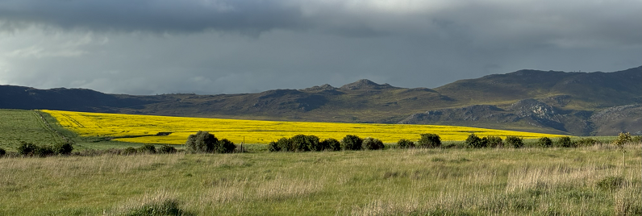
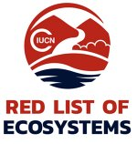

```{=html}
<!-- Outer wrapper: "column-screen" is a Quarto built-in that breaks out to full
     browser width; "nba-hero" is a custom label so custom.scss can find and style it -->
<div class="column-screen nba-hero">

  <!-- The banner photo itself. src = file path to the image.
       alt = text read aloud by screen readers / shown if the image fails to load -->
  

  <!-- Inner box holding just the text that sits on top of the photo -->
  <div class="nba-hero-text">

<!-- Eyebrow line above the headline. &nbsp; = non-breaking space,
     used here to keep visible space around the "·" separator without
     it wrapping onto its own line -->
<div class="eyebrow">
  <span>National Biodiversity Assessment 2025</span>&nbsp;·&nbsp;<span>Terrestrial realm</span>
</div>

    <!-- Main page heading. <h1> tells browsers/screen readers/search engines
         "this is the most important heading on the page" -->
    <h1>South Africa's Red List of Terrestrial Ecosystems</h1>

    <!-- Subtitle sentence, as a plain paragraph -->
    <p>A national assessment of the threat status status informing policy, conservation and land-use planning</p>

  </div> <!-- closes .nba-hero-text -->

  <!-- Photo credit, positioned independently (bottom-right) — not nested inside
       the text box above, so it can be placed separately by CSS -->
  <div class="credit">Agriculture in the Hemel-en-Aarde Valley, Western Cape. (© Andrew Skowno)</div>

</div> <!-- closes .nba-hero, the outer wrapper -->
```

<br>

<div class="main-copy">
  <p><span class="drop-cap">T</span>he South African National Biodiversity Institute (SANBI) is a statutory institution established under section 10(1) of the National Environmental Management: Biodiversity Act, 2004 (NEMBA). Part of its mandate is to periodically assess and report on the state of South Africa's biodiversity, delivered through the National Biodiversity Assessment (NBA) report. The NBA represents a collaborative effort to synthesise the best available science on the country's biodiversity to inform policy, support decision-making across multiple sectors, and contribute to national development priorities.</p>
</div>


::: {.info-panels}

::: {.info-panel}
::: {.info-header}
<span class="info-icon-badge">
<svg width="20" height="20" viewBox="0 0 24 24" fill="none" xmlns="http://www.w3.org/2000/svg">
  <path d="M6 2H14L19 7V22H6V2Z" stroke="white" stroke-width="1.8" stroke-linejoin="round"/>
  <path d="M14 2V7H19" stroke="white" stroke-width="1.8" stroke-linejoin="round"/>
  <line x1="9" y1="12" x2="16" y2="12" stroke="white" stroke-width="1.8" stroke-linecap="round"/>
  <line x1="9" y1="16" x2="16" y2="16" stroke="white" stroke-width="1.8" stroke-linecap="round"/>
</svg>
</span>

#### The legal framework
:::

NEMBA also provides the legal framework for the identification and protection of ecosystems that are threatened and in need of protection. Section 52(1)(a) of NEMBA gives power to the Minister to publish, by a notice in the Government Gazette, a national list of ecosystems that are threatened and in need of protection. One of the key regulatory implications of the list of threatened ecosystems is its relationship with the environmental authorisation framework under the National Environmental Management Act, 1998 (Act No. 107 of 1998) (NEMA), including activities listed in Listing Notice 3. Depending on the activity, applicable thresholds, and specified geographic conditions, certain activities undertaken within listed threatened ecosystems may require environmental authorisation. The gazetted national list also serves as an important decision-support resource for land-use planning, biodiversity conservation and management, as well as its incorporation into the national Environmental Screening Tool.
:::

::: {.info-panel}
::: {.info-header}
<span class="info-icon-badge">

</span>

#### The RLE
:::
South Africa's ecosystem threat status also known as the Red List of Ecosystems, is both a national and global headline indicator reported on periodically by the South African National Biodiversity Institute. Its revision cycle is aligned with the National Biodiversity Assessment (NBA) reporting cycle, with updates undertaken approximately every five to seven years. The International for Union Conservation of Nature (IUCN) Red List of Ecosystems (RLE) standards were first applied systematically across all terrestrial ecosystems as part of the NBA 2018. The resulting list was subsequently reviewed and gazetted in November 2022 [gazetted in November 2022, follwing its review](https://www.dffe.gov.za/sites/default/files/sites/default/files/docs/publications/nema_threatenedecosystemslist_g47526gon2747.pdf).
:::
:::

The NBA 2025 represents the first update of the 2022 gazetted list and is currently going through the review process, which will eventually result in its publication under the Government Gazette, replacing the current gazetted list. With each iteration, the assessment draws on the best available information on ecosystem extent, condition, and the pressures and drivers of change to reflect the state of the country's biodiversity at an ecosystem level. As one of the ecosystem indicators recognised within the Kunming-Montreal Global Biodiversity Framework of the Convention on Biological Diversity, to which South Africa is a signatory, the RLE also contributes to the country's international biodiversity reporting obligations.

:::: {.columns}
::: {.column width="30%" .sidebar}
::: {.bordered-box}
## At a glance

<div class="stat">
  <span class="num">463</span>
  <div class="desc">assessed ecosystem types</div>
</div>

<div class="stat">
  <span class="num">980,945 km²</span>
  <div class="desc">remaining natural habitat, circa 2022</div>
</div>

<div class="stat">
  <span class="num">2018→ 2025</span>
  <div class="desc">status change between cycles </div>
</div>
:::
:::

::: {.column width="70%"}
The ecosystem threat status assessments follow the IUCN RLE Framework (Version 2.0) and cover all 463 terrestrial ecosystem types currently described for South Africa (Mucina and Rutherford 2006; with updates described in Dayaram et al. 2017, 2019; and Dayaram et al. 2026, in prep). Between the 2022 gazetted list and the NBA 2025 RLE assessment, eight new ecosystem types were introduced, and one ecosystem type was superseded, following refinements to the national terrestrial ecosystem map. 

Changes in threat status between assessment iterations can signal genuine ecological and/or spatial decline driven by new or intensifying threats, but can also arise from improvements to the underlying input data, particularly for ecosystems assessed under Criterion A (reduction in geographic distribution) and Criterion B (restricted geographic distribution). This review examines these [changes between 2022 gazetted list and the list from the NBA 2025 RLE assessment](Contents/scripts/status_change.qmd#sec-status-changes), and identifies factors driving them. It provides a summary of status change by category, a biome-level breakdown, and the IUCN RLE criteria underpinning current classifications.
:::
::::


<!-- Closes the {.column-screen #body-inset} div opened above the
     intro paragraph. Everything above this point now shares the
     SAME full-bleed mechanism as the hero banner. The map below
     stays outside this wrapper, in its own narrower
     .contained-figure box. -->

::: {.contained-figure}
```{python}
#| label: fig-rle-combined
#| fig-cap: "Map (A) shows the historical extent of terrestrial threatened ecosystem types in South Africa, with the inset graph indicating the number of ecosystem types in each Red List of Ecosystems category. Map (B) shows the remaining natural extent (circa 2022) of threatened terrestrial ecosystems; white areas represent non-natural areas such as croplands, built-up areas, mines, dams and tree plantations. The inset graph in (B) shows the percentage of the total remaining natural habitat (980,945 km²) within each category"
#| echo: false

import urllib.request
from IPython.display import Image

from IPython.display import Image
Image(filename="./Contents/images/RLE_combined_maps_manuallyfixed.png")

```

:::

::: column-margin

## Ecosystem types excluded

 The National Vegetation Map includes 466 ecosystem types. However, one type is endemic to Lesotho, and Swamp Forest and Mangrove Forest are transitional types that are assessed in other realms. Therefore, these three types are excluded from the terrestrial RLE assessments.

:::